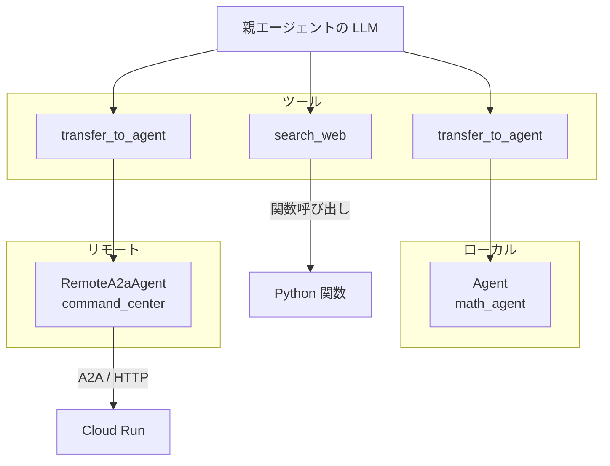

こんにちは、 [@Katonium0615](https://x.com/Katonium0615) です。[Japan Google Cloud Usergroup for Enterprise (Jagu'e'r)](https://jaguer.jp/) でエバンジェリストをしています。

少し前になりますが、2月にJagu'e'r クラウドネイティブ分科会のイベントに参加しました。2025年4月にGoogle Cloudから発表された[A2A](https://cloud.google.com/blog/ja/products/ai-machine-learning/a2a-a-new-era-of-agent-interoperability)を実際に触ってみたので、その体験レポートです。

https://jaguer-cloud-native.connpass.com/event/380666/

イベントはこれでした。資料は公開されていないものの、前半がA2Aの概要説明、後半が実際にA2Aを触ってみるハンズオン、という構成でした。
僕もクラウドネイティブ分科会の運営ですが、今回はほぼ参加者としてイベントを楽しみました。

## ADKとは？

ADK（Agent Development Kit）は、Google が提供する AI エージェント開発のためのフレームワークです。Python でエージェントを定義し、ツールやサブエージェントを組み合わせて複雑なタスクを実行させることができます。Gemini をはじめとした LLM と Vertex AI の統合が組み込まれており、ローカル開発から Cloud Run へのデプロイまでシームレスに行えるのが特徴です。

https://google.github.io/adk-docs/

## A2Aとは？

A2A（Agent-to-Agent）は、異なる AI エージェント同士が互いに通信・連携するためのオープンプロトコルです。2025年4月に Google Cloud から発表されました。

各エージェントは「Agent Card」という JSON を公開し、自分の名前・説明・スキル（何ができるか）を宣言します。他のエージェントはその Agent Card を読み取ることで、相手が何をできるかを知り、A2A プロトコルを通じてタスクを依頼できます。エージェントのフレームワークや実装言語に依存しない、相互運用性を目指した仕組みです。


## ハンズオン

後半では実際にADKとA2Aを触ってみるハンズオンを行いました。ハンズオンの内容や学んだことを簡単に振り返っていきます。

ハンズオンのコードは全てこちらのリポジトリにあります。興味がある方はぜひクローンして触ってみてください。

https://github.com/jaguer-sandbox/jaguer-cloudnative-a2a-handson

### セットアップ

まずは環境構築です。今回は `uv` を使ってPython環境をセットアップしました。

```bash
uv venv
source .venv/bin/activate
uv sync
```

Vertex AI を使うために `.env` ファイルを用意します。

```bash
echo "GOOGLE_CLOUD_PROJECT=$(gcloud config get-value project)" > .env
echo "GOOGLE_CLOUD_LOCATION=us-central1" >> .env
echo "GOOGLE_GENAI_USE_VERTEXAI=true" >> .env
```

あとは ADC の設定と、必要な API の有効化をしておきます。

```bash
gcloud auth application-default login
gcloud services enable cloudresourcemanager.googleapis.com run.googleapis.com artifactregistry.googleapis.com aiplatform.googleapis.com cloudbuild.googleapis.com cloudtrace.googleapis.com --project=$(gcloud config get-value project)
```

### ステップ1：最初のエージェントを作成

ADKでは、`{エージェントをまとめたディレクトリ}/{エージェント名}/agent.py` という階層構造でエージェントのコードを配置します。今回は `test-agents/agent/agent.py` を作成しました。

```python
from google.adk import Agent

root_agent = Agent(
    name="explorer_agent",
    model="gemini-2.5-flash",
    description="宝探しをする探検家エージェントです",
    instruction="あなたは探検家です。挨拶をしてください。",
)
```

たったこれだけで AI エージェントが作れます。`adk web test-agents` で起動して、ブラウザからチャットしてみると、ちゃんと挨拶を返してくれました。


*立ち上がったADKのUIで挨拶をする僕と、すかさず自己紹介をかますAIエージェント*

### ステップ2：ローカルのSub Agentと連携する

次に、エージェント同士の連携を試してみます。探検家エージェントに、計算が得意な「計算係エージェント」をサブエージェントとしてつけてみました。

```python
from google.adk import Agent

# 計算を担当するローカルエージェント（Sub Agent）
math_agent = Agent(
    name="math_agent",
    model="gemini-2.5-flash",
    description="計算を行うエージェントです",
    instruction="ユーザーから依頼された計算を行ってください。",
)

# 親となる探検家エージェント
root_agent = Agent(
    name="explorer_agent",
    model="gemini-2.5-flash",
    description="探検家エージェントです",
    instruction="算数の計算については math_agent に計算を依頼してください。",
    sub_agents=[math_agent]
)
```

`sub_agents` にエージェントを登録するだけで、親エージェントが必要に応じて子エージェントにタスクを振るようになります。「100 + 200 の計算をしてください」と聞くと、ちゃんと `math_agent` に処理が委譲されていることが Trace タブから確認できました。


*計算タスクを探検家エージェントが計算係エージェントに振っている様子。イベントログから、計算係エージェントがタスクを処理していることがわかります*

余談ですが、このときは計算係エージェントが回答しています。計算係エージェントを `sub_agents` ではなく Tool として登録することで、計算係エージェントが回答するのではなく、探検家エージェントが計算結果を回答するようにすることもできます。

```python
from google.adk import Agent
from google.adk.tools.agent_tool import AgentTool

math_agent = Agent(
    name="math_agent",
    model="gemini-2.5-flash",
    description="計算を行うエージェントです",
    instruction="ユーザーから依頼された計算を行ってください。",
)

root_agent = Agent(
    name="explorer_agent",
    model="gemini-2.5-flash",
    description="探検家エージェントです",
    instruction="算数の計算については math_agent に計算を依頼してください。",
    tools=[AgentTool(math_agent)]  # sub_agents ではなく tools として登録
)
```

`sub_agents` の代わりに `tools=[AgentTool(math_agent)]` とすることで、`math_agent` は「ツール」として扱われます。つまり、`math_agent` は裏で計算するだけで、ユーザーへの回答は `explorer_agent` が行うようになります。


*計算係エージェントをToolとして登録した場合。トレースのツリーの形が変わり、探検家エージェントが計算結果を回答しているのがわかります*

ついでに少しだけ、AgentToolの中身を覗いてみましょう。ADKのソースコードを読んでみると、`sub_agents` と `AgentTool` の違いがよくわかります。

#### sub_agents の仕組み

`sub_agents` を使った場合、ADKは内部で `transfer_to_agent` という特殊なツールをLLMに渡しています。LLMはサブエージェントの `description` を見て「こっちのエージェントに任せたほうがいいな」と判断すると、会話の主導権をそのサブエージェントに**転送**します。

ADKのソースコード（`agent_transfer.py`）を見ると、LLMに以下のような指示が自動的に追加されていることがわかります。

```
You have a list of other agents to transfer to:
Agent name: math_agent
Agent description: 計算を行うエージェントです

If another agent is better for answering the question according to its
description, call `transfer_to_agent` function to transfer the question
to that agent.
```

つまり、**会話の制御が子エージェントに移り**、子エージェントが直接ユーザーに応答します。同じセッション・同じコンテキストの中で動くので、状態も共有されます。

#### AgentTool の仕組み

一方、`AgentTool` を使った場合は全く違います。ADKのソースコード（`agent_tool.py`）を見ると、`run_async` の中で**新しい Runner とセッションが作られている**ことがわかります。

```python
# AgentTool.run_async() の中身（抜粋）
runner = Runner(
    app_name=child_app_name,
    agent=self.agent,
    session_service=InMemorySessionService(),  # 新しいセッション！
    memory_service=InMemoryMemoryService(),     # 新しいメモリ！
)
```

子エージェントは**隔離された環境**で実行され、その結果だけが親エージェントに返されます。親エージェントはその結果を受け取って、自分の言葉でユーザーに回答します。いわば「裏方に聞いてきた」という動き方です。

#### まとめ

| 観点 | sub_agents | AgentTool |
|------|-----------|-----------|
| 会話の主導権 | 子エージェントに移る | 親エージェントが維持 |
| 実行コンテキスト | 同じセッション・状態を共有 | 新しいセッションで隔離 |
| LLMからの見え方 | `transfer_to_agent` ツール | 通常のツール呼び出し |

用途に応じて使い分けるとよさそうです。コンテキストを分離する必要がない場合にはまずは `sub_agents` で試してみて、必要に応じて `AgentTool` を使うのが良いのではないでしょうか。

### ステップ3：リモートエージェントにA2Aで接続する

ここからがA2Aの本番です。ローカルのサブエージェントを、運営が用意してくれた「司令部エージェント」に差し替えます。

:::message
ハンズオン内では運営がデプロイしたリモートエージェントへ接続を実施しました。ご自身で試される場合は、クローンしたリポジトリの `agents` ディレクトリにエージェントのコードが用意されているので、そちらを参考にしてデプロイする必要があります。
:::


```python
from google.adk import Agent
from google.adk.agents.remote_a2a_agent import RemoteA2aAgent
import os
from dotenv import load_dotenv
load_dotenv()

# 外部の司令部Agentを定義（Agent CardのURLを指定）
command_center_agent = RemoteA2aAgent(
    name="command_center_agent",
    agent_card=os.getenv("COMMAND_AGENT_AGENT_CARD"),
)

root_agent = Agent(
    name="explorer_agent",
    model="gemini-2.5-flash",
    description="宝探しをする探検家エージェントです",
    instruction="start をすると探検が始まります。まず command_center_agent にミッションを聞いてください。",
    sub_agents=[command_center_agent]
)
```

ポイントは `RemoteA2aAgent` です。Agent Card の URL を指定するだけで、インターネットの向こう側にいるエージェントを、ローカルのサブエージェントとまったく同じように扱えます。先ほどの `math_agent` を登録したのと同じ `sub_agents` の書き方で、呼び出し方が変わらないのがADKの強力な抽象化ですね。

`start` と送ってみると、リモートの司令部エージェントからミッションが届きました！


*リモートエージェントからの応答が返ってきています！感動*

### ステップ4：全エージェントを接続して宝探し完了

いよいよ本番です。司令部・鍵守・宝箱の全エージェントをサブエージェントとして登録し、一気に宝探しを完了させます。

```python
from google.adk import Agent
from google.adk.agents.remote_a2a_agent import RemoteA2aAgent
import os
from dotenv import load_dotenv
load_dotenv()

# 1. 司令部
command_center_agent = RemoteA2aAgent(
    name="command_center_agent",
    agent_card=os.getenv("COMMAND_AGENT_AGENT_CARD"),
)
# 2. 鍵守（クイズを出す）
key_master_agent = RemoteA2aAgent(
    name="key_master_agent",
    agent_card=os.getenv("KEY_MASTER_AGENT_AGENT_CARD"),
)
# 3. 宝箱
treasure_chest_agent = RemoteA2aAgent(
    name="treasure_chest_agent",
    agent_card=os.getenv("TREASURE_CHEST_AGENT_AGENT_CARD"),
)

root_agent = Agent(
    name="explorer_agent",
    model="gemini-2.5-flash",
    description="クイズを解いて宝を探す Agent です",
    instruction="""
    あなたは、宝を探す Agent です。

    宝探しは以下の手順で行ってください。
    1. command_center にミッションを聞く
    2. key_master にクイズを出してもらい、ユーザに回答してもらう。
    3. 回答を key_master に渡し、key_master から鍵を受け取る。受け取れなければ再度 key_master にクイズを出してもらってください。key_master から鍵を受け取れない限りはこれを続けます。
    4. もらった鍵を treasure_chest に渡して、宝を受け取る
    5. 最後に得られた結果を報告して終了する
    """,
    sub_agents=[
        command_center_agent,
        key_master_agent,
        treasure_chest_agent,
    ]
)
```

ここで重要なのは、エージェントの動きを制御しているのが `instruction` という**自然言語**だけということです。コードで制御フローを書いているわけではなく、「まず司令部に聞いて、次に鍵守にクイズを出してもらって...」という指示だけで、エージェントが自律的に判断して動きます。


*全エージェントを接続して宝探しを実施している様子。イベントログから、司令部エージェントにミッションを聞いて、鍵守エージェントにクイズを出してもらい、ユーザーが回答して、鍵守エージェントから鍵を受け取って、宝箱エージェントに渡しているのがわかります*


### ステップ5：Cloud Run へのデプロイ

ローカルで動いたエージェントを、Cloud Run にデプロイしてみます。まず `test-agents/agent/requirements.txt` を作成します。

```txt
google-adk[a2a]
```

そして `adk deploy` コマンド一発でデプロイできます。

```bash
adk deploy cloud_run \
  --project=$GOOGLE_CLOUD_PROJECT \
  --region=asia-northeast1 \
  --service_name=explorer-agent \
  --app_name=explorer_agent \
  --port=8080 \
  --with_ui \
  test-agents/agent \
  -- --allow-unauthenticated --env-vars-file .env
```

`--` の後ろに gcloud の Cloud Run デプロイオプションをそのまま渡せるのが便利ですね。`--env-vars-file .env` で、ローカルの `.env` の内容をそのままCloud Run の環境変数に渡しています。

デプロイが完了すると Service URL が発行されます。ブラウザで開くと、ローカルで見ていたのと同じチャット画面が表示されて、クラウド上でもちゃんとエージェントが動きました。


### ステップ6：Observability（Cloud Trace）

A2A でエージェント同士が自律的に会話していると、何かあったときの原因究明が大変です。ADK は Google Cloud と統合されており、Cloud Trace を使ってエージェント間の通信を可視化できます。

デプロイコマンドに `--trace_to_cloud` を追加するだけで有効になります。

```bash
adk deploy cloud_run \
  --trace_to_cloud \
  --project=$GOOGLE_CLOUD_PROJECT \
  --region=asia-northeast1 \
  --service_name=explorer-agent \
  --app_name=explorer_agent \
  --port=8080 \
  --with_ui \
  test-agents/agent \
  -- --allow-unauthenticated --env-vars-file .env
```

Cloud Trace を開くと、どのエージェントがいつ、どのくらいの時間をかけて応答したかが一目瞭然です。「鍵守エージェントの応答が遅いからボトルネックになっている」といった問題の発見にも使えます。

また、Cloud Logging ではエージェントの思考プロセス（Thought）や判断、送受信メッセージが全て記録されています。A2A開発では「ログとトレースを活用して、見えない会話を可視化する」ことが、安定したシステム運用の鍵になりそうです。

ただし現状では、trace_id が A2A エージェント間で伝播しないため、例えば司令部エージェントの内部でどういう処理が行われているかは、司令部側のトレースを見る必要があります。このあたりは今後改善されていくことを期待しています。

## おまけ：A2A・ADKについて

ここまででハンズオンの内容は終わりですが、せっかくなので、ADKの中でA2Aプロトコルがどのように実装されているかを少しだけ覗いてみましょう。

### 「ローカルもリモートも同じ」の正体

ハンズオンでは、ローカルの `math_agent` をリモートの `RemoteA2aAgent` に差し替えるだけで A2A 通信が動きました。なぜこんなにシームレスなのでしょうか。

ADK のソースコードを読んでみると、`RemoteA2aAgent` は `BaseAgent` を継承しています。つまり、ローカルの `Agent` と同じインターフェースを持っているということです。親エージェントや ADK 内部の転送メカニズム（`agent_transfer.py`）からすると、相手がローカルかリモートかは区別がつきません。

さらに面白いのは、ステップ2で見た `sub_agents` の仕組みがそのまま使われていることです。ADK は `sub_agents` に登録されたエージェントを `transfer_to_agent` という共通のツールとして LLM に渡します。LLM はエージェントの `description` を見て転送先を選びますが、その先がローカルの Python オブジェクトなのか、HTTP の先にいるリモートエージェントなのかは関知しません。

```
LLM → transfer_to_agent("math_agent")     → ローカルで実行
LLM → transfer_to_agent("command_center")  → A2A で HTTP 通信
```

つまり、抽象化は2層あります。1つ目は `BaseAgent` という共通インターフェース、2つ目は `transfer_to_agent` という共通ツール。この2層の抽象化によって「ローカルもリモートも同じ」が実現されています。



LLMから見ると、すべてが「ツール呼び出し」です。ツールの中身がローカルの Python 関数なのか、リモートの HTTP エンドポイントなのかは、LLMには見えません。これが「ローカルもリモートも同じ」の正体です。

これによってLLMにとってはすべてが『ツール』であるという、非常にシンプルな作りになっていることがわかります。

UNIXの「すべてはファイル」、オブジェクト指向の「すべてはオブジェクト」と同じ系譜の、非常に良い抽象化だと思いました。ADKの設計の良さが伝わってきます（Googleのエンジニアが作っているので当然かもしれませんが）。


### A2A メッセージの構造

A2A プロトコルでは、メッセージは **Part** のリストで構成されます。Part には3種類あります。

| Part | 運ぶもの | 用途 |
|------|---------|------|
| **TextPart** | テキスト | チャットメッセージ、説明文 |
| **FilePart** | ファイル | 画像や PDF。URI 参照か Base64 埋め込みの2パターン |
| **DataPart** | 構造化 JSON | ツール呼び出し結果やコード実行結果など |

これらを組み合わせて1つのメッセージを作ります。JSON-RPCなので、JSONのPart要素の一つの構造になっているはずです。（下記はPythonオブジェクトですが、転送時も同様の構造のJSONなのかな...？と考えらています。）

```python
A2AMessage(
    message_id="uuid-string",
    parts=[TextPart(...), FilePart(...), DataPart(...)],
    role="user",           # "user" or "agent"
    context_id="...",      # セッション識別用（stateful の場合）
)
```

呼び出し元は常にこの `A2AMessage` でリクエストを送ります。レスポンスはシンプルなメッセージか、あるいは **Task** として返ってきます。

### Task と Artifact：対話ではなく「仕事を依頼する」

A2A プロトコルの面白いところは、単なるチャットではなく **Task（タスク）** という概念があることです。リモートエージェントは、リクエストに対して「メッセージ」ではなく「タスク」として応答できます。

```
Client ─── A2A Message（依頼）───→ Server
Client ←── Task（状態遷移＋成果物）←── Server
```

Task には `submitted → working → completed` という状態遷移があり、完了時には **Artifact**（成果物）を含めることができます。Artifact はメッセージと同じく Part のリストを持つので、テキスト・ファイル・構造化データの組み合わせが成果物になれます。

```
Task
├── status: submitted → working → completed（or failed）
├── history: [やりとりの履歴]
└── artifacts: [成果物のリスト]
    └── Artifact
        └── parts: [TextPart, FilePart, DataPart, ...]
```

Task が失敗した場合は `failed` ステータスとエラーメッセージが返されます。Artifact は成功時にだけ付与される「納品物」です。

この設計からは、A2A プロトコルが「エージェント同士でおしゃべりする」ためのものではなく、**複数のエージェントが協調してタスクを遂行する仕組み**を目指していることが読み取れます。依頼して、進捗を追って、成果物を受け取る。まさにチームでの仕事の進め方ですね。

ADKではA2Aで呼び出された際の応答はデフォルトでTask形式を利用するようになっています。ADKで作成されたAgent同士は可能な限りTask形式でやりとりするようになっているというところから、開発者は「A2Aは対話ではなく仕事の依頼のためのプロトコル」という位置づけとして考えているのかなと思いました。たしかにAgentになにかを依頼する場面では、Agent同士の雑談ではなくタスクを遂行してほしいですよね。

### Agent Card の中身と遅延ロード

A2A のディスカバリの起点となる Agent Card には、以下のような情報が含まれています。

| フィールド | 内容 |
|-----------|------|
| `name` | エージェント名 |
| `description` | エージェントの説明 |
| `url` | JSON RPC エンドポイント |
| `skills` | スキル一覧（名前、説明、入出力 MIME type） |
| `capabilities` | 対応機能（ストリーミング、プッシュ通知等） |
| `default_input_modes` / `default_output_modes` | 受け付ける/出力する MIME type |
| `security` | 認証方式（OAuth、API Key 等） |
| `protocol_version` | A2A プロトコルバージョン |

ただし、この全てが LLM に渡されるわけではありません。ADK のソースコードを読むと、`agent_transfer.py` の `_build_target_agents_info()` が LLM のシステムプロンプトに注入するのは **`name` と `description` だけ**です。`url` や `security` などの技術的な情報はフレームワークが裏で処理し、LLM には見せません。

そして、Agent Card の取得は**遅延ロード**になっています。`RemoteA2aAgent` をインスタンス化した時点では HTTP リクエストは飛ばず、LLM が実際に `transfer_to_agent` を呼んだタイミングで初めて取得されます。

実際に試してみたところ、存在しない URL を Agent Card に設定してもアプリは正常に起動し、`transfer_to_agent` が実行された瞬間に初めて 404 エラーが出ました。


*transfer_to_agentが実行されるまでエラーがでず、Agent Cardが遅延読み込みされていることがわかります*

この仕組みのおかげで、10個のリモートエージェントを登録しても起動は一瞬ですし、一部のエージェントがダウンしていても使われないなら問題ありません。

ただし、注意点があります。Agent Card から `description` が自動補完される仕組みがあるのですが、これは遅延ロードが完了した後にしか効きません。つまり、`RemoteA2aAgent` に `description` を設定しないと、**初回の転送判断時に LLM はそのエージェントの説明を持たない**状態になります。実用上は親エージェントの `instruction` に転送先の説明を書いておけば動きますが、`description` を明示的に設定しておくか、`instruction` でいつどのサブエージェントを呼ぶべきなのかをしっかり書いておくのがベストプラクティスです。
Agentが起動したときには、SubAgent側のdescriptionではなく、親Agentのinstructionを見て転送先を判断することになります。そのため、親Agentのinstructionにはサブエージェントの説明や呼び出し条件を書いておくのがベストプラクティスです。
（SubAgent側が「こういうときに呼び出して」と宣言するのではなく、呼び出し方は呼び出し元がSubAgent側をどう使いたいかという事情で決まる、というのは妥当な設計思想だなと思いました）


## おわりに

今回のハンズオンで、ADK と A2A を使ったエージェント間連携を一通り体験できました。印象的だったのは以下のポイントです。

- **ADK のシンプルさ**: `Agent` クラスを作って `sub_agents` に登録するだけで連携が動く。『すべてはツール』という抽象化によって、非常にシンプルなコードにまとまるなという印象を受けました。
- **A2A の透過性**: `RemoteA2aAgent` を使えば、ローカルでもリモートでもコードの書き方が変わらないのは開発速度・体験の面で非常に良いです。ここもADKがそういうユーザー体験を意識した設計をしているんだなと感じます。
- **自然言語での制御**: エージェントの振る舞いは `instruction` だけで制御できる。if 文や制御フローをコードで書く必要がありません。
- **Cloud Run へのデプロイ**: `adk deploy` コマンド一発でクラウドに上がる手軽さはGoogleのエンジニアが作ったフレームワークならではだなと思いました。AI時代のクラウドネイティブなプロダクトって感じで好きです。

エージェント同士が自律的に会話して目的を達成する A2A の世界、なかなか面白いです。マルチエージェントを使う前にもちろんエージェント単体でのチューニングも非常に重要ですが、A2Aの実力を存分に引き出せるようなシステムをいつか描いてみたいなと感じました。

また、ADKがこれだけよくできているのであれば、Strands Agentsにも別の良さがあるのではないかと気になりました。そちらはいつかの機会に触れるとして、今回はこの辺で終わりにしたいと思います。
