## はじめに

BigQuery の**承認済みビュー（Authorized View）**は、機密データを含むデータセットに対して、ビューを通じて限定的なアクセスを提供する機能です。似た機能として**承認済みデータセット（Authorized Dataset）**もありますが、両者のセキュリティ上の違いについて、ドキュメントだけでは判断しづらい点がありました。

特に気になったのは以下の点です。

- 承認済みビューの SQL を編集したら「再承認」が必要なのか？
- ソースデータへの権限を持たないユーザーが、ビューの SQL を書き換えて機密データを抜き出せてしまわないか？
- 承認済みビューと承認済みデータセットで、権限チェックの挙動は異なるか？

これらの疑問に対して、Terraform + Go テストで検証環境を構築し、自動テストで仕様を実証しました。

## 結論

先に結論をまとめます。

| 操作 | 承認済みビュー | 承認済みデータセット |
|---|:---:|:---:|
| ビュー経由の閲覧 | OK | OK |
| 管理者がビュー SQL を更新後、即反映されるか | OK（再承認不要） | OK（再承認不要） |
| 制限ユーザーがビュー SQL を変更 | 403 拒否 | 403 拒否 |
| 制限ユーザーが新規ビューを作成 | 403 拒否 | 403 拒否 |
| 未承認データセットへの参照 | 403 拒否 | 403 拒否 |
| ネストされた多段参照 | OK | OK |
| ネストのバイパス（中間層を飛ばして直接参照） | 403 拒否 | 403 拒否 |

承認済みビュー・承認済みデータセットのどちらでも、ビューを作成・編集するユーザーは参照先テーブルへの `bigquery.tables.getData` 権限が必要です。権限のないユーザーがビューの SQL を改ざんして機密データを取得することは、どちらの方式でも防がれます。

両者の違いは**管理の粒度**にあります。

- **承認済みビュー**: ビュー単位で個別に承認。新しいビューを追加するたびに参照先データセットの承認リストへの登録が必要
- **承認済みデータセット**: データセット全体を一括で承認。将来追加されるビューも自動的に承認されるため、多数のビューを運用する場合に管理の手間が軽減される

## 検証環境の構成

### 全体像

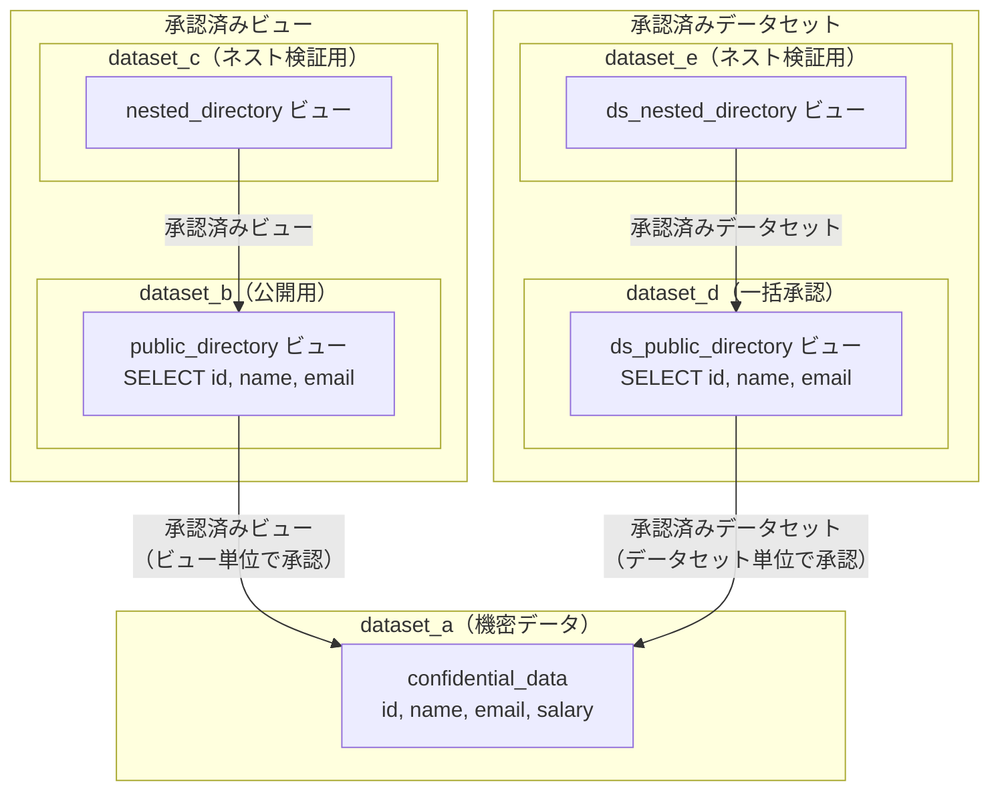

### ユーザー構成

| ユーザー | 役割 | 権限 |
|---|---|---|
| user1 | 管理者 | dataset_a〜e すべてに `dataOwner` |
| user2 | 制限ユーザー（承認済みビュー検証用） | dataset_b, dataset_c に `dataViewer` + `dataEditor` |
| user3 | 制限ユーザー（承認済みデータセット検証用） | dataset_d, dataset_e に `dataViewer` + `dataEditor` |

user2, user3 はいずれも **dataset_a（機密データ）への直接権限を持ちません**。

## 承認済みビューのテストケース

### ケース 1: ビュー経由の閲覧（正常系）

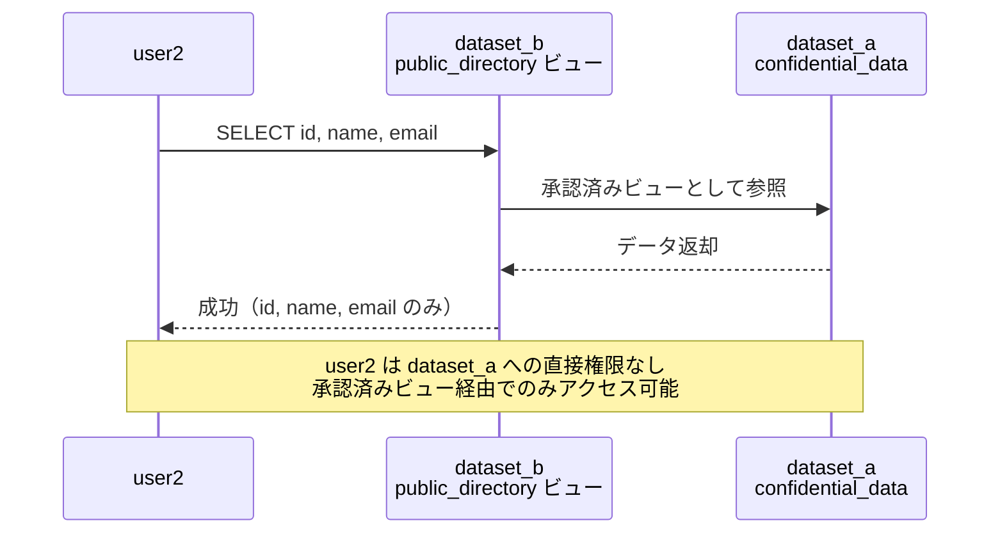

### ケース 2: 悪意のある更新（異常系）

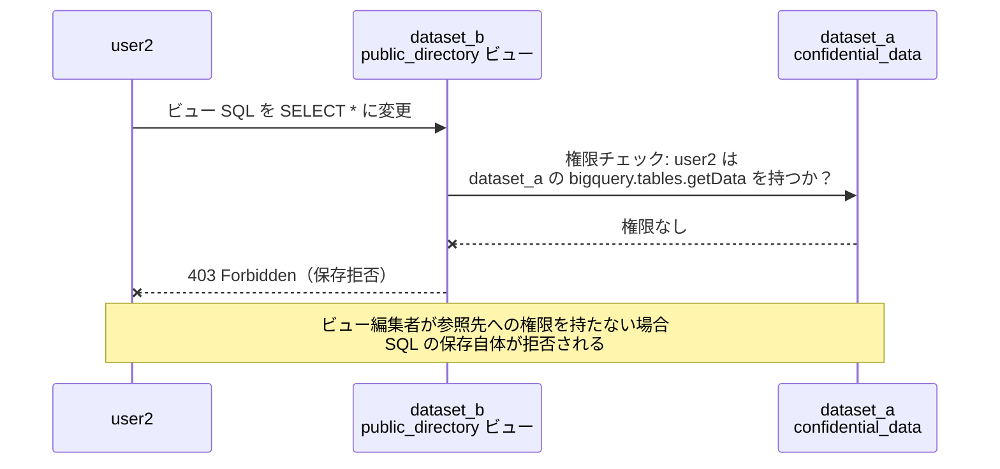

### ケース 3: 管理者による更新と再承認の不要性（正常系）

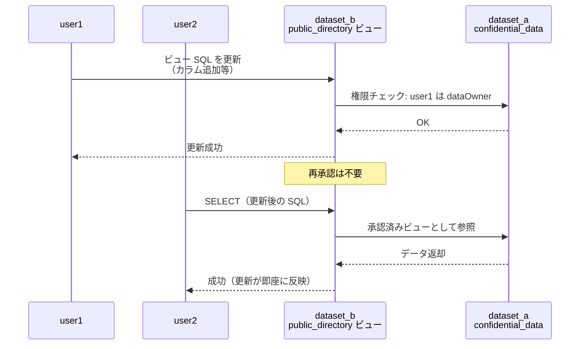

### ケース 4: 不正なビュー作成（異常系）

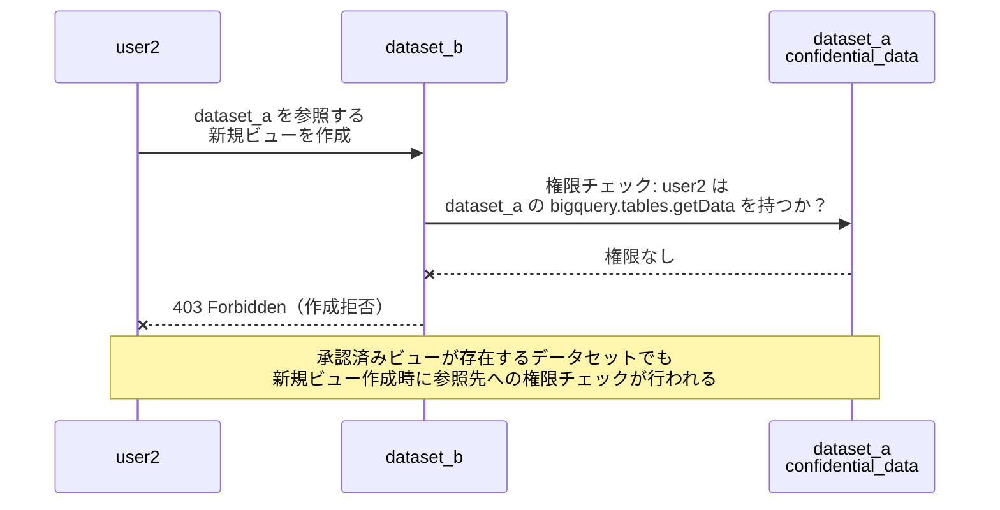

### ケース 5: ネストされた承認（正常系）

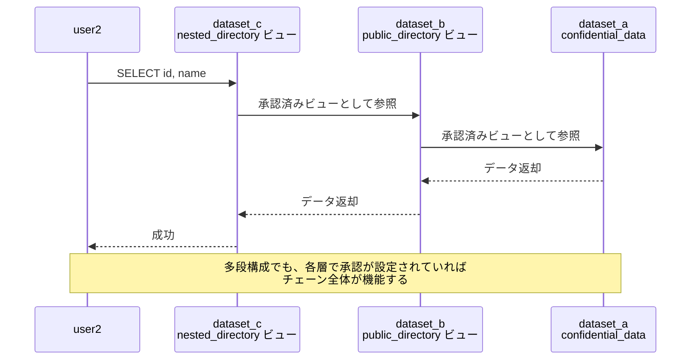

### ケース 6: ネストのバイパス（異常系）

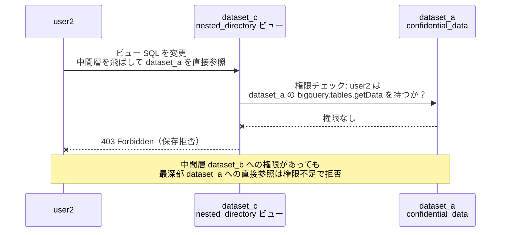

## 承認済みデータセットのテストケース

### ケース 1: データセット経由の閲覧（正常系）

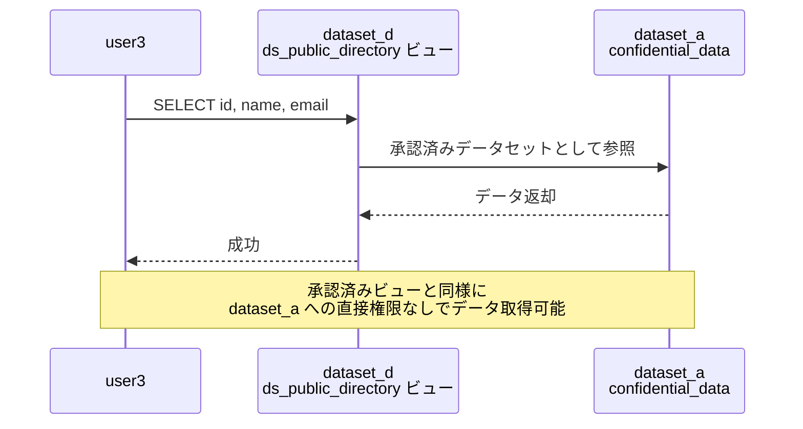

### ケース 2: 不正なビュー作成（異常系）

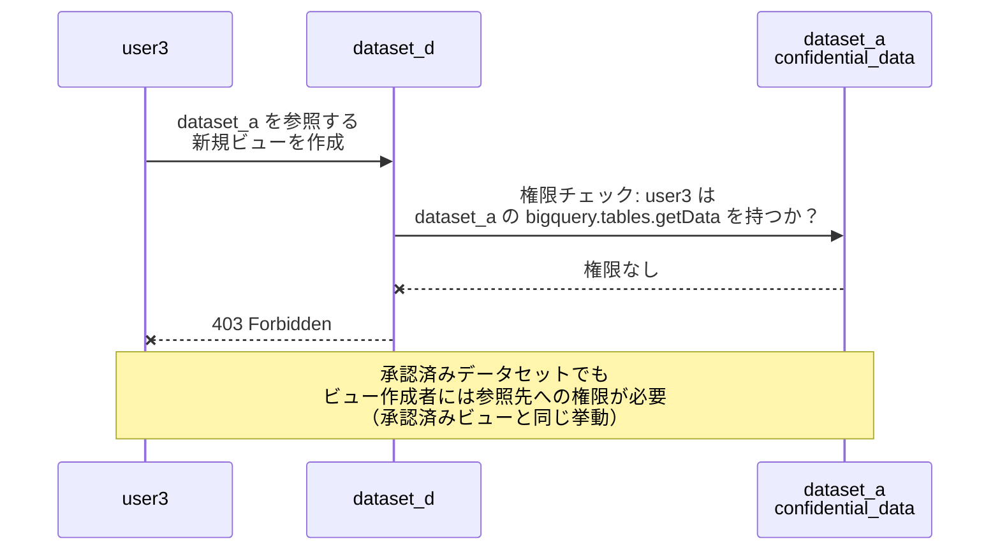

### ケース 3: 悪意のある SQL 変更（異常系）

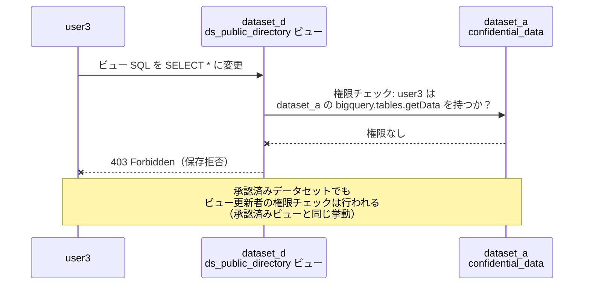

### ケース 4: 範囲外データセットへの参照（異常系）

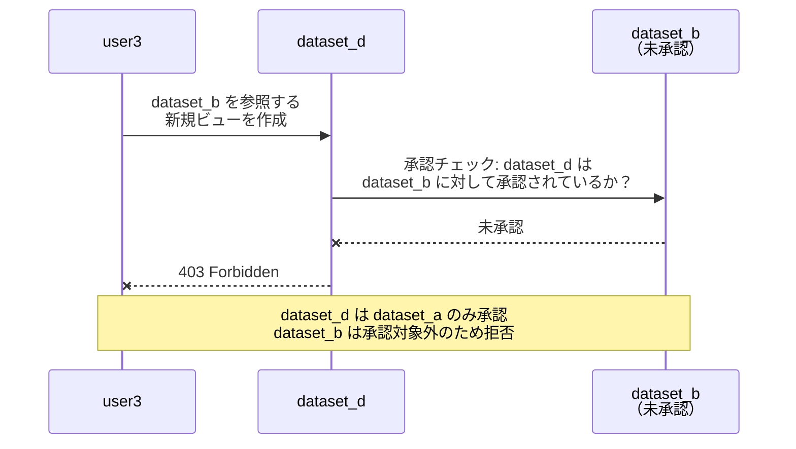

### ケース 5: ネストされた承認（正常系）

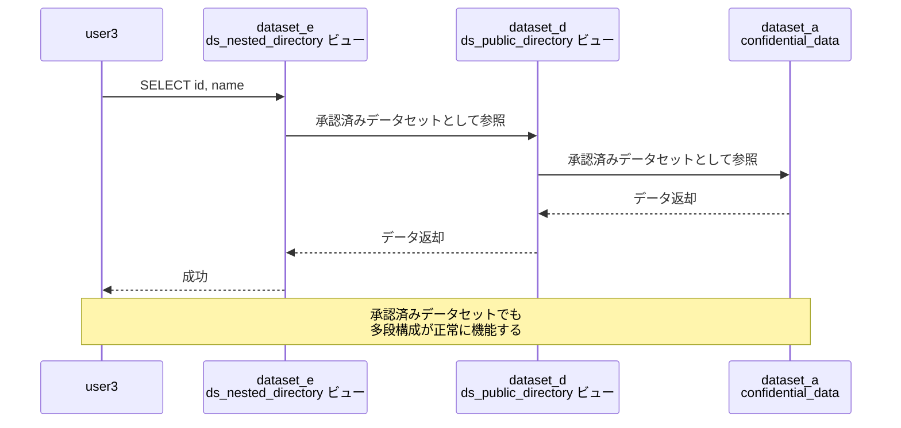

### ケース 6: ネストのバイパス（異常系）

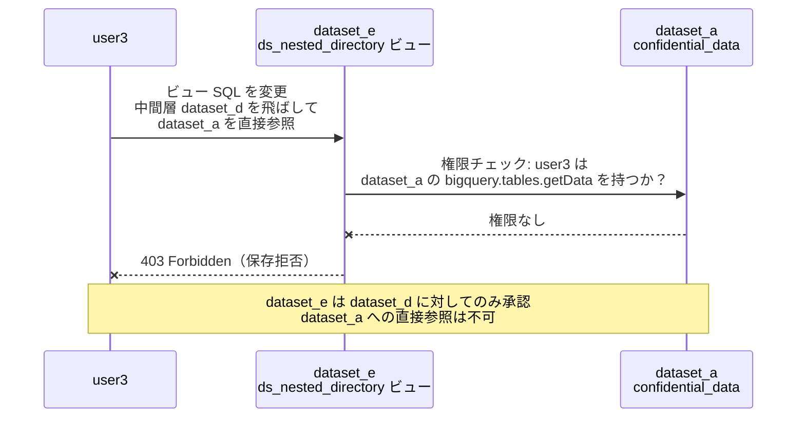

## 検証環境の構築

### Terraform

検証環境は Terraform で IaC 管理しています。ポイントは以下の通りです。

- **ローカル State**: 検証用のため Remote Backend は使用しない
- **ランダムサフィックス**: リソース名に `random_id` のサフィックスを付与し、冪等性を確保
- **Service Account Impersonation**: テスト実行者が各ユーザーになりすませるよう、`google_service_account_iam_member` で `roles/iam.serviceAccountTokenCreator` を付与

承認済みビューの承認設定:

```hcl
# ビュー単位で承認（承認済みビュー）
resource "google_bigquery_dataset_access" "authorize_view_b" {
  dataset_id = google_bigquery_dataset.dataset_a.dataset_id

  view {
    project_id = var.project_id
    dataset_id = google_bigquery_dataset.dataset_b.dataset_id
    table_id   = google_bigquery_table.authorized_view.table_id
  }
}
```

承認済みデータセットの承認設定:

```hcl
# データセット単位で承認（承認済みデータセット）
resource "google_bigquery_dataset_access" "authorize_dataset_d" {
  dataset_id = google_bigquery_dataset.dataset_a.dataset_id

  dataset {
    dataset {
      project_id = var.project_id
      dataset_id = google_bigquery_dataset.dataset_d.dataset_id
    }
    target_types = ["VIEWS"]
  }
}
```

`view` ブロックと `dataset` ブロックの違いが、承認済みビューと承認済みデータセットの設定の違いです。

### Go テスト

テストは Go のテーブル駆動テスト（Table-Driven Tests）で実装しています。Service Account Impersonation には `google.golang.org/api/impersonate` パッケージを使用し、JSON 鍵の発行は行っていません。

```go
func newImpersonatedClient(t *testing.T, ctx context.Context, projectID, targetSA string) *bigquery.Client {
    ts, err := impersonate.CredentialsTokenSource(ctx, impersonate.CredentialsConfig{
        TargetPrincipal: targetSA,
        Scopes:          []string{"https://www.googleapis.com/auth/bigquery"},
    })
    // ...
    client, err := bigquery.NewClient(ctx, projectID, option.WithTokenSource(ts))
    return client
}
```

異常系テストでは、Google API の 403 エラーコードを明示的にアサーションしています。

```go
func isPermissionDenied(err error) bool {
    if apiErr, ok := err.(*googleapi.Error); ok {
        return apiErr.Code == 403
    }
    return false
}
```

### 実行方法

```bash
export GOOGLE_CLOUD_PROJECT="your-project-id"
make init    # terraform init
make all     # apply → test → destroy を一括実行
```

## まとめ

承認済みビューと承認済みデータセットのセキュリティ仕様を自動テストで検証した結果、以下のことが分かりました。

1. **再承認は不要**: 管理者がビュー SQL を更新しても、承認の再設定は必要ない。更新後のビューは即座にユーザーに反映される
2. **編集者の権限チェックは常に行われる**: 承認済みビュー・承認済みデータセットのどちらでも、ビューを作成・編集するユーザーには参照先への `bigquery.tables.getData` 権限が必要。これにより SQL 改ざんによるデータ漏洩が防がれている
3. **両者の違いは管理の粒度**: 承認済みビューはビュー単位、承認済みデータセットはデータセット単位。セキュリティレベルは同等で、運用上の管理コストが異なる

検証に使用したコードは [GitHub リポジトリ](https://github.com/katonium/articles/tree/zenn/main/samplecodes/bq-authorized-view) で公開しています。
