## はじめに

BigQuery の**承認済みビュー（Authorized View）**は、機密データを含むデータセットに対して、ビューを通じて限定的なアクセスを提供する機能です。似た機能として**承認済みデータセット（Authorized Dataset）**もありますが、両者のセキュリティ上の違いについて、ドキュメントだけでは判断しづらい点がありました。

特に気になったのは以下の点です。

- 承認済みビューの SQL を編集したら「再承認」が必要なのか？
- ソースデータへの権限を持たないユーザーが、ビューの SQL を書き換えて機密データを抜き出せてしまわないか？
- 承認済みビューと承認済みデータセットで、権限チェックの挙動は異なるか？

これらの疑問に対して、Terraform + Go テストで検証環境を構築し、自動テストで仕様を実証しました。

## 結論

先に結論をまとめます。

| 操作 | 承認済みビュー | 承認済みデータセット |
|---|:---:|:---:|
| ビュー経由の閲覧 | OK | OK |
| 管理者がビュー SQL を更新後、即反映されるか | OK（再承認不要） | OK（再承認不要） |
| 制限ユーザーがビュー SQL を変更 | 403 拒否 | 403 拒否 |
| 制限ユーザーが新規ビューを作成 | 403 拒否 | 403 拒否 |
| 未承認データセットへの参照 | 403 拒否 | 403 拒否 |
| ネストされた多段参照 | OK | OK |
| ネストのバイパス（中間層を飛ばして直接参照） | 403 拒否 | 403 拒否 |

承認済みビュー・承認済みデータセットのどちらでも、ビューを作成・編集するユーザーは参照先テーブルへの `bigquery.tables.getData` 権限が必要です。権限のないユーザーがビューの SQL を改ざんして機密データを取得することは、どちらの方式でも防がれます。

両者の違いは**管理の粒度**にあります。

- **承認済みビュー**: ビュー単位で個別に承認。新しいビューを追加するたびに参照先データセットの承認リストへの登録が必要
- **承認済みデータセット**: データセット全体を一括で承認。将来追加されるビューも自動的に承認されるため、多数のビューを運用する場合に管理の手間が軽減される

## 検証環境の構成

### 全体像

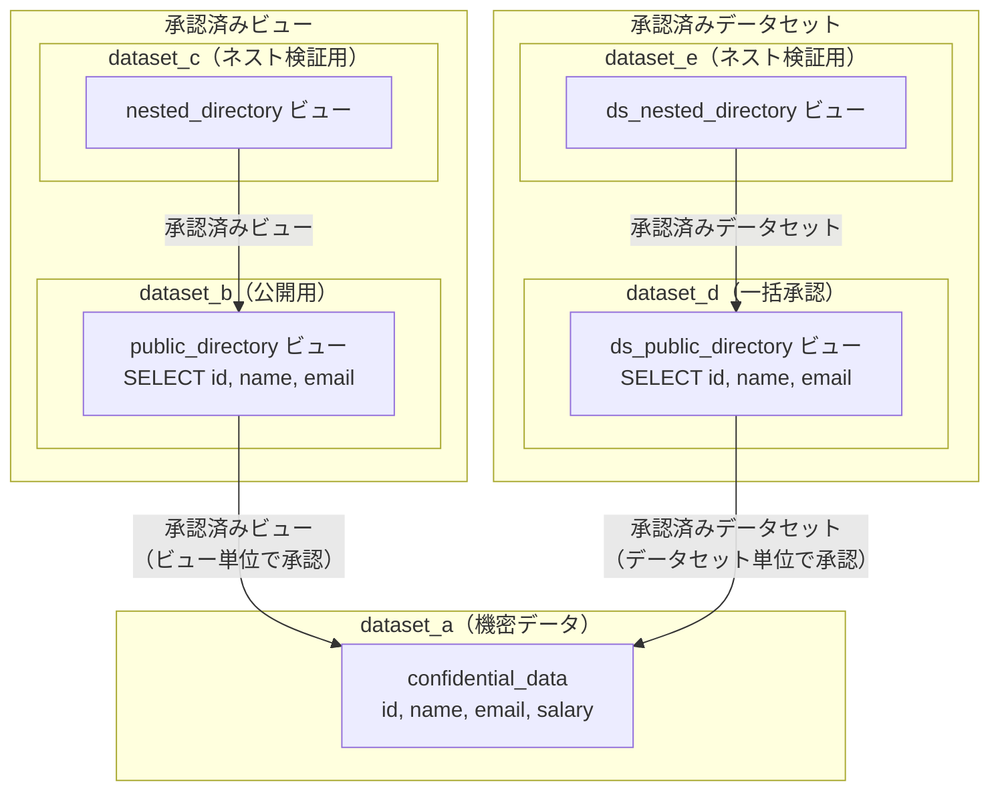

### ユーザー構成

| ユーザー | 役割 | 権限 |
|---|---|---|
| user1 | 管理者 | dataset_a〜e すべてに `dataOwner` |
| user2 | 制限ユーザー（承認済みビュー検証用） | dataset_b, dataset_c に `dataViewer` + `dataEditor` |
| user3 | 制限ユーザー（承認済みデータセット検証用） | dataset_d, dataset_e に `dataViewer` + `dataEditor` |

user2, user3 はいずれも **dataset_a（機密データ）への直接権限を持ちません**。

## 承認済みビューのテストケース

### ケース 1: ビュー経由の閲覧（正常系）

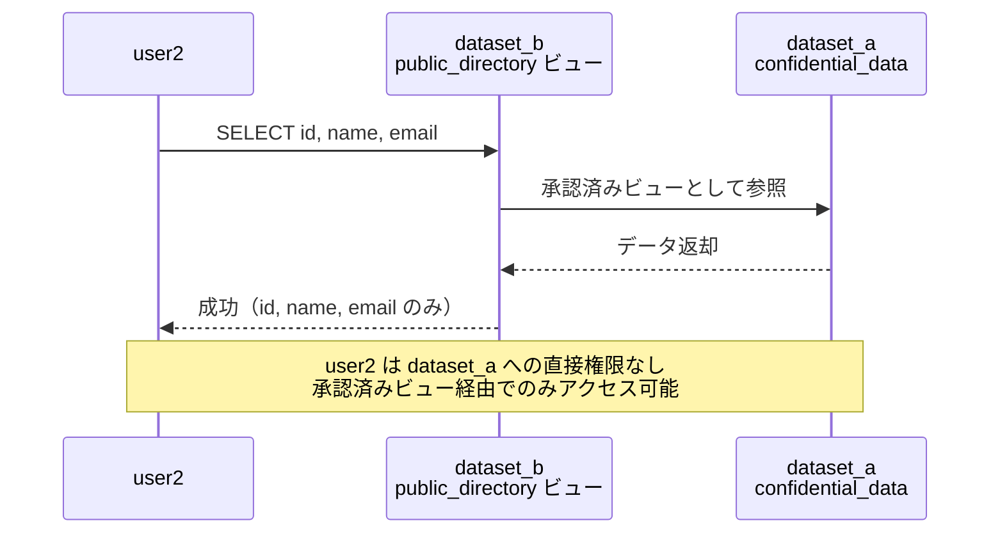

### ケース 2: 悪意のある更新（異常系）

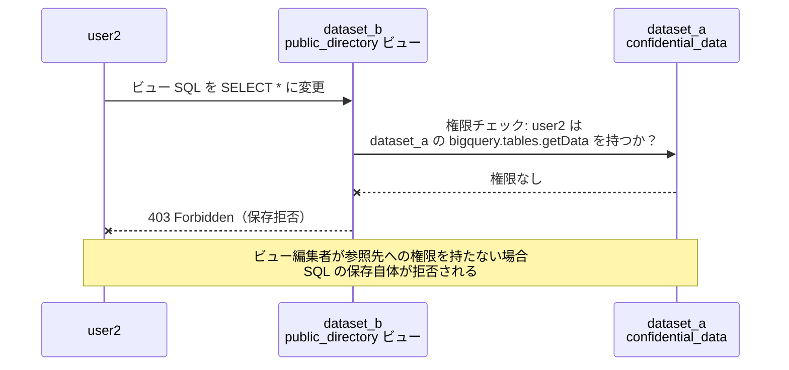

### ケース 3: 管理者による更新と再承認の不要性（正常系）

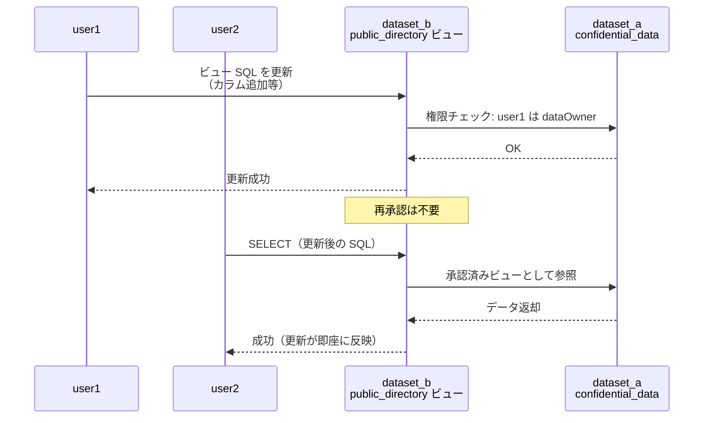

### ケース 4: 不正なビュー作成（異常系）

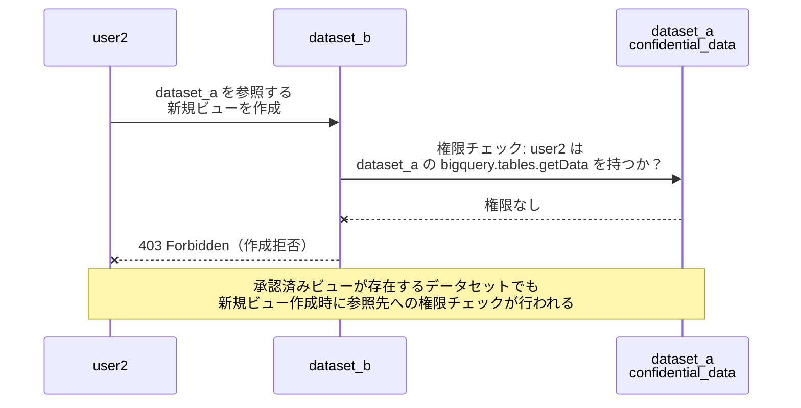

### ケース 5: ネストされた承認（正常系）

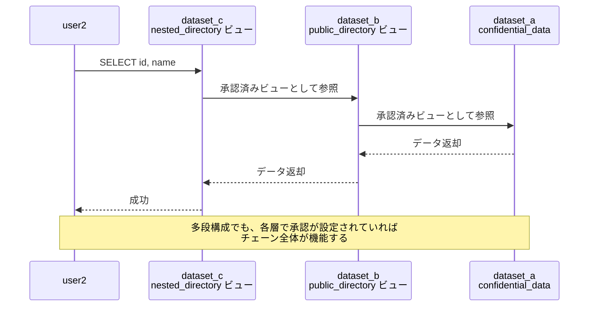

### ケース 6: ネストのバイパス（異常系）

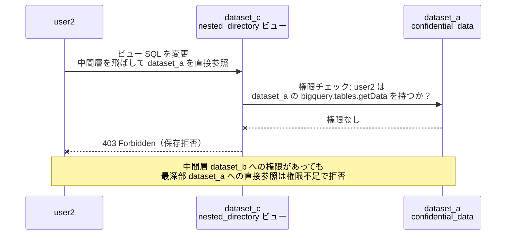

## 承認済みデータセットのテストケース

### ケース 1: データセット経由の閲覧（正常系）

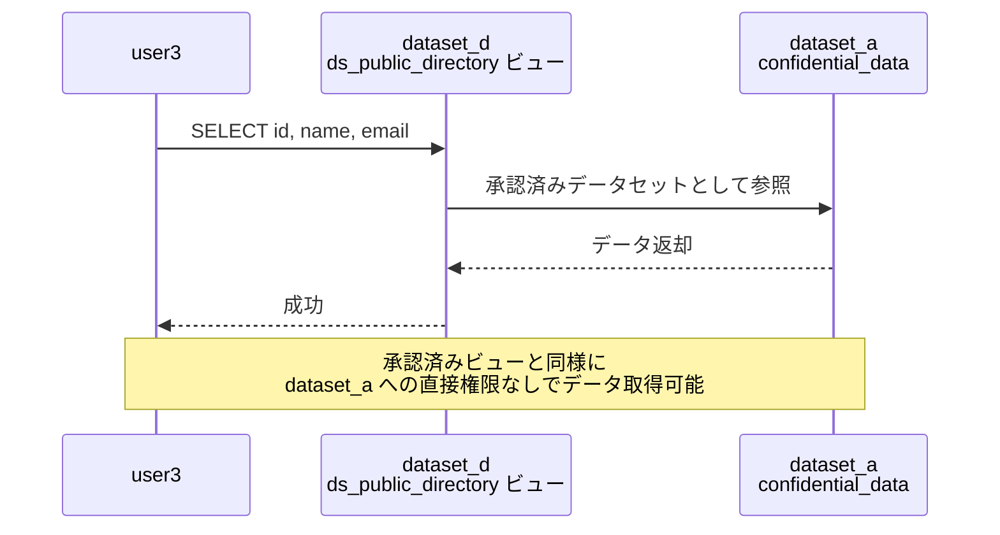

### ケース 2: 不正なビュー作成（異常系）

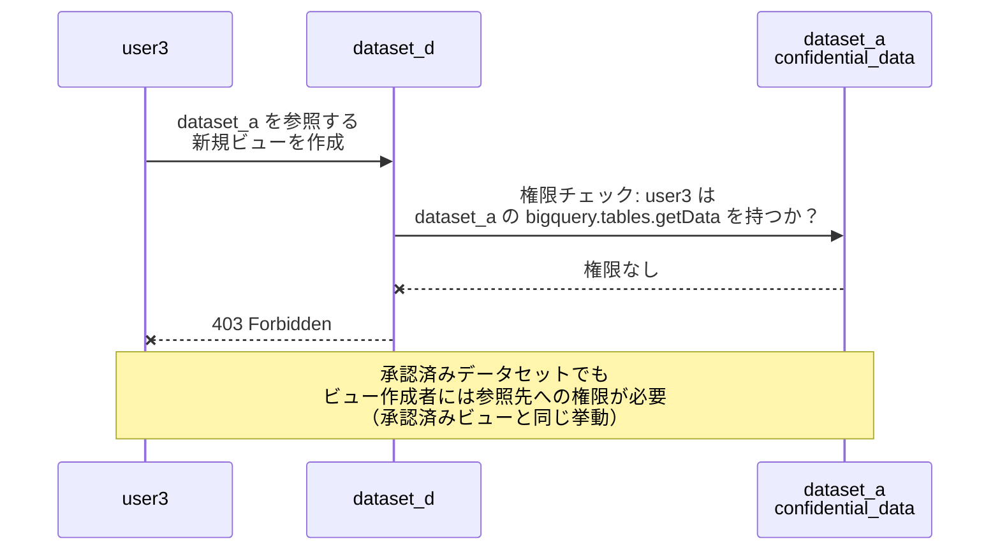

### ケース 3: 悪意のある SQL 変更（異常系）

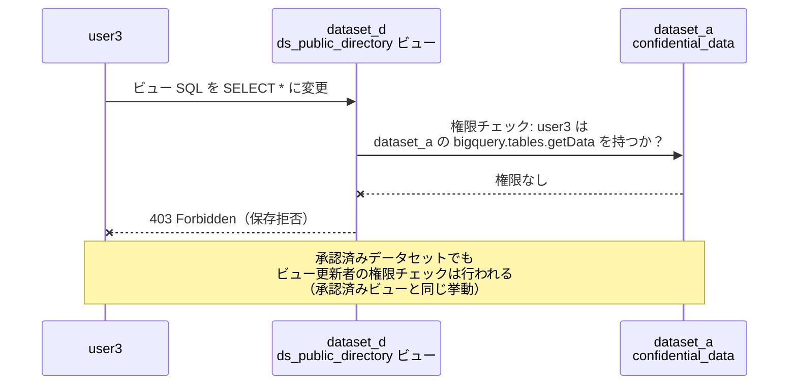

### ケース 4: 範囲外データセットへの参照（異常系）

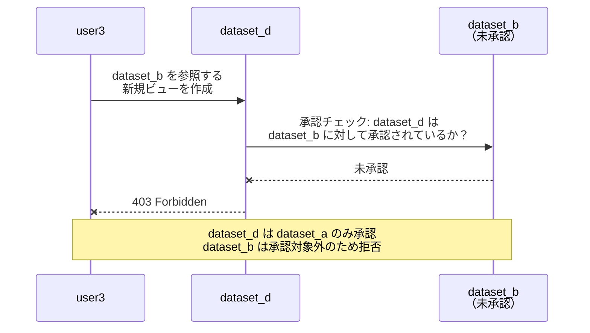

### ケース 5: ネストされた承認（正常系）

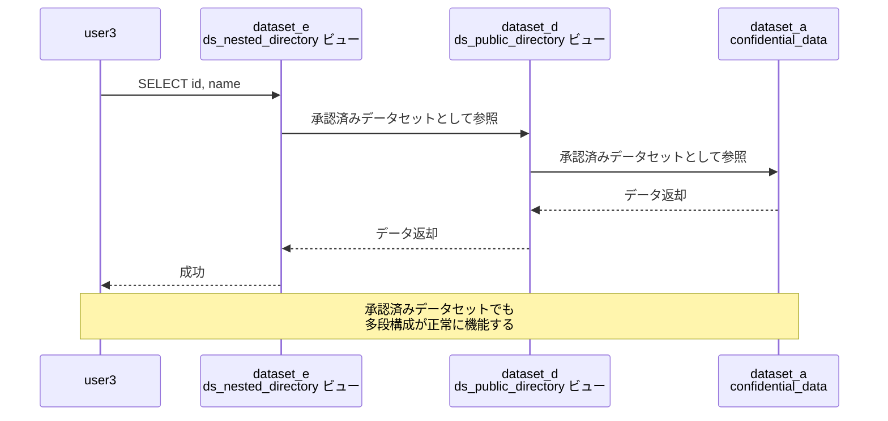

### ケース 6: ネストのバイパス（異常系）

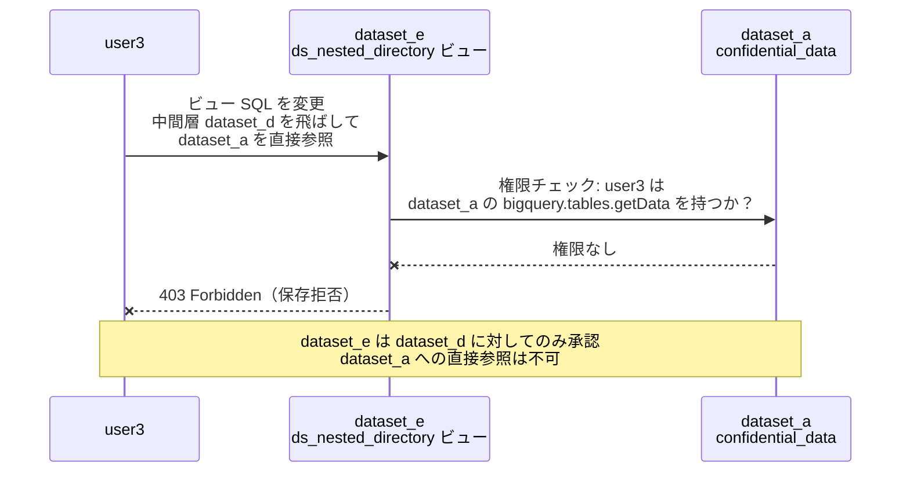

## 検証環境の構築

### Terraform

検証環境は Terraform で IaC 管理しています。ポイントは以下の通りです。

- **ローカル State**: 検証用のため Remote Backend は使用しない
- **ランダムサフィックス**: リソース名に `random_id` のサフィックスを付与し、冪等性を確保
- **Service Account Impersonation**: テスト実行者が各ユーザーになりすませるよう、`google_service_account_iam_member` で `roles/iam.serviceAccountTokenCreator` を付与

承認済みビューの承認設定:

```hcl
# ビュー単位で承認（承認済みビュー）
resource "google_bigquery_dataset_access" "authorize_view_b" {
  dataset_id = google_bigquery_dataset.dataset_a.dataset_id

  view {
    project_id = var.project_id
    dataset_id = google_bigquery_dataset.dataset_b.dataset_id
    table_id   = google_bigquery_table.authorized_view.table_id
  }
}
```

承認済みデータセットの承認設定:

```hcl
# データセット単位で承認（承認済みデータセット）
resource "google_bigquery_dataset_access" "authorize_dataset_d" {
  dataset_id = google_bigquery_dataset.dataset_a.dataset_id

  dataset {
    dataset {
      project_id = var.project_id
      dataset_id = google_bigquery_dataset.dataset_d.dataset_id
    }
    target_types = ["VIEWS"]
  }
}
```

`view` ブロックと `dataset` ブロックの違いが、承認済みビューと承認済みデータセットの設定の違いです。

### Go テスト

テストは Go のテーブル駆動テスト（Table-Driven Tests）で実装しています。Service Account Impersonation には `google.golang.org/api/impersonate` パッケージを使用し、JSON 鍵の発行は行っていません。

```go
func newImpersonatedClient(t *testing.T, ctx context.Context, projectID, targetSA string) *bigquery.Client {
    ts, err := impersonate.CredentialsTokenSource(ctx, impersonate.CredentialsConfig{
        TargetPrincipal: targetSA,
        Scopes:          []string{"https://www.googleapis.com/auth/bigquery"},
    })
    // ...
    client, err := bigquery.NewClient(ctx, projectID, option.WithTokenSource(ts))
    return client
}
```

異常系テストでは、Google API の 403 エラーコードを明示的にアサーションしています。

```go
func isPermissionDenied(err error) bool {
    if apiErr, ok := err.(*googleapi.Error); ok {
        return apiErr.Code == 403
    }
    return false
}
```

### 実行方法

```bash
export GOOGLE_CLOUD_PROJECT="your-project-id"
make init    # terraform init
make all     # apply → test → destroy を一括実行
```

## ハマりポイント 1: 承認済みビューを勝手に書き換えることはできない

承認済みビューは「承認した瞬間に保護が始まる」仕組みです。参照先データセットへの編集権限（`bigquery.tables.getData`）を持たないユーザーは、たとえ `dataEditor` ロールを持っていても、ビューの SQL を編集できなくなります。カラム順序を変えるだけの良性編集ですら拒否されます。

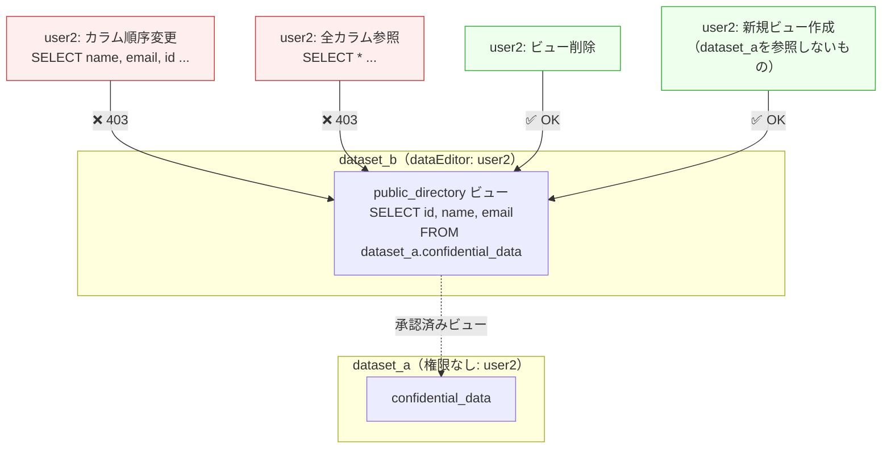

ポイントは以下の通りです。

- **編集は一切不可**: 同一 SQL での更新であっても、参照先への権限がなければ 403 で拒否されます（※BigQuery が SQL の差分なしと判定した場合は no-op として許可される場合があります）
- **削除と新規作成は可能**: `dataEditor` 権限があればビューの削除・新規作成自体はできます。ただし新規ビューは承認リストに含まれないため、機密データへのアクセスはできません
- **`dataEditor` では承認操作自体も不可**: 承認済みビューリストの変更には `bigquery.datasets.update` 権限（`dataOwner` 以上）が必要です

### 承認済みビュー vs 承認済みデータセットでのビュー作成の違い

承認済みビューと承認済みデータセットでは、制限ユーザーが新規ビューを作成しようとしたときの挙動が異なります。

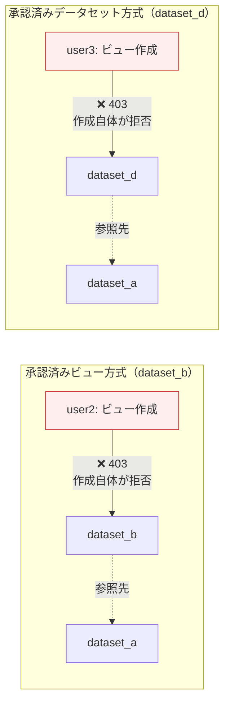

どちらの方式でも、参照先データセットへの権限を持たないユーザーによるビュー作成は 403 で拒否されます。承認済みデータセットはデータセット全体を一括承認する仕組みですが、ビュー作成者への権限チェックはバイパスされません。

## ハマりポイント 2: SELECT * でビューを作成するとカラム追加が自動追従する

ハマりポイント 1 の通り、承認済みビューの SQL を勝手に書き換えることはできません。しかし **`SELECT *` で定義したビューは、元テーブルにカラムが追加されると自動的に新カラムも公開されてしまいます**。

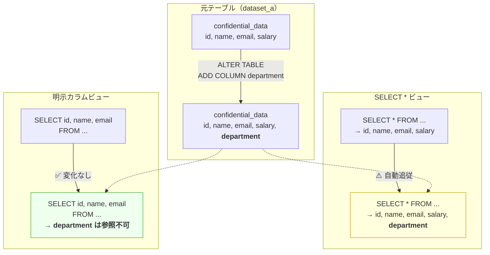

テストでは、承認済みデータセット内にそれぞれのビューを作成し、元テーブルに `department` カラムを追加したうえで動作を検証しました。

- **`SELECT *` ビュー**: `SELECT department FROM ビュー` が成功 → 新カラムが自動追従
- **明示カラムビュー**: `SELECT department FROM ビュー` が `Unrecognized name` エラー → 追従しない

特に外部に公開するデータセットや、カラムの制限をビューに頼っている場合はこの仕様が問題になります。**`SELECT col_a, col_b, ...` と都度カラムを指定するようにしておくのが無難です**。

## ハマりポイント 3: 多段承認ビューの編集には前後のデータセット権限が必要

多段構成（dataset_c → dataset_b → dataset_a）のビューを編集する場合、**編集対象ビューの「前」（参照先）と「後」（配置先）のデータセットへの権限があれば OK** です。最深部の dataset_a への権限は不要です。

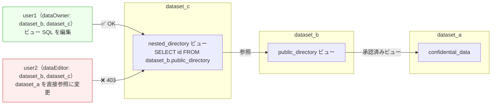

ただし注意点があります。

- 編集には参照先データセット（dataset_b）の **`bigquery.datasets.update` 権限が必要**です。`dataEditor` ロールではこの権限が含まれないため、`dataOwner` 以上が必要になります
- 中間層を飛ばして dataset_a を直接参照するような変更は、dataset_a への権限がないため 403 で拒否されます

動かさないとわからないポイントではあるのでまとめましたが、**多段ビューの編集が必要になる構成はほぼアンチパターンです**。承認済みビューをテーブルの公開に使うのは良いですが、多段ビュー構成にすると内部がブラックボックスになりすぎます。どうしても多段構成にする場合は、片方のビューは `SELECT *` で作成する等の規約を設けておくことをおすすめします。

## ハマりポイント 4: 承認済みビューは管理が大変

承認済みビューはビュー単位で承認を管理するため、ビューの数が増えるほど管理コストが増大します。

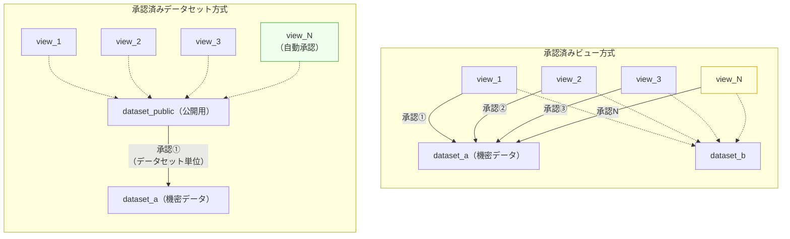

多くのビューを管理することが想定されるのであれば、**承認済みデータセットを利用して「公開用データセット」と「非公開データセット」を作成するパターン**にしておいたほうが良いです。IaC 管理であっても承認設定の数が多くなると Terraform コードが複雑になりますし、AI に管理させるとしても複雑度を下げられるところは可能な限り下げるべきです。ぱっと見て状況がわかるシンプルな構成を目指しましょう。

## ハマりポイント 5: Analytics Hub や Data Clean Room を使う場合に承認済みビューは不要？

「Analytics Hub を使うなら承認済みビューは不要」と思われがちですが、実際は**用途が異なる**ため組み合わせることで拡張性が向上します。

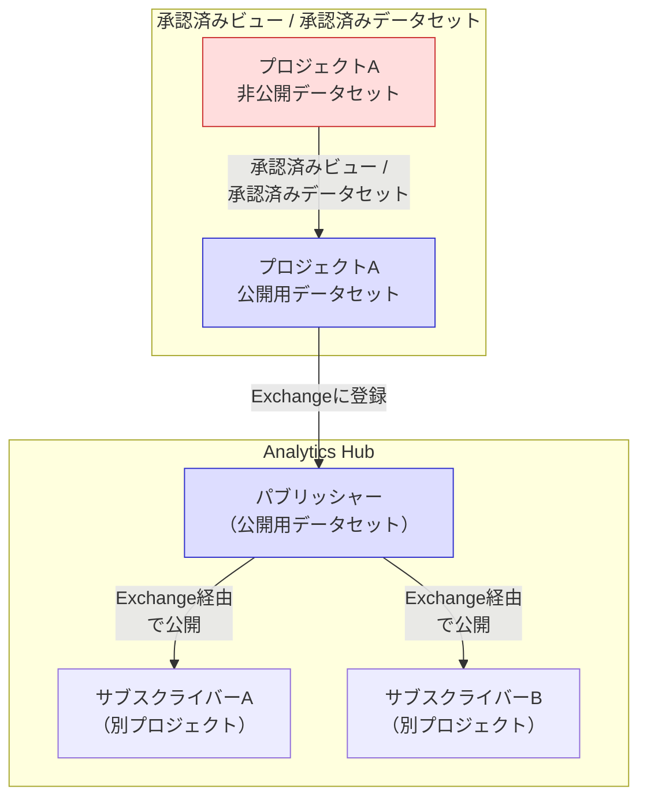

| | 承認済みビュー / 承認済みデータセット | Analytics Hub |
|---|---|---|
| **目的** | データへのアクセスを許可する | プロジェクトをまたいでデータを共有する |
| **共有モデル** | ピアリング型（点と点の共有） | Pub/Sub型（公開 & セルフサービス利用） |
| **スコープ** | 同一プロジェクト内のデータセット間 | 組織を超えたデータ共有 |
| **ネットワーク比喩** | VPC Peering に近い | Shared VPC に近い |

Analytics Hub（Exchange や Clean Room）はデータセット単位での公開を行います。ここで承認済みビューを組み合わせるメリットが生まれます。

- **公開範囲の柔軟な制御**: いままで非公開にしていたテーブルを公開したくなった場合、テーブル定義の移動やデータのコピーなしにビューを貼るだけで、公開用データセットへのアクセス権を持つユーザーが非公開データセットのテーブルを利用できる
- **非公開への切り戻し**: 公開していたテーブルを非公開にしたい場合も、ビューの削除だけで完了

とはいえビューを通すことによるブラックボックス感は残るので、**データの保護は別サービス（VPC SC、カラムレベルセキュリティ等）に任せ、承認済みビューはデータの透過的なアクセスという面で利用する程度に留める**のが良さそうです。

ゴールまでの線を引いて、何でつなぐかを考えるイメージです。プロジェクト内のデータセット間の共有には承認済みビュー/データセット、外部への公開には Analytics Hub、というように使い分けましょう。

## まとめ

承認済みビューと承認済みデータセットのセキュリティ仕様を自動テストで検証した結果、以下のことが分かりました。

1. **再承認は不要**: 管理者がビュー SQL を更新しても、承認の再設定は必要ない。更新後のビューは即座にユーザーに反映される
2. **編集者の権限チェックは常に行われる**: 承認済みビュー・承認済みデータセットのどちらでも、ビューを作成・編集するユーザーには参照先への `bigquery.tables.getData` 権限が必要。これにより SQL 改ざんによるデータ漏洩が防がれている
3. **両者の違いは管理の粒度**: 承認済みビューはビュー単位、承認済みデータセットはデータセット単位。セキュリティレベルは同等で、運用上の管理コストが異なる
4. **`SELECT *` は避ける**: カラム追加が自動追従するため、公開範囲が意図せず拡大するリスクがある。明示的にカラムを指定するのが無難
5. **多段ビューは慎重に**: 編集には前後のデータセットの `dataOwner` 権限が必要。構成がブラックボックス化しやすいためアンチパターンになりがち
6. **ビュー数が多い場合は承認済みデータセットを使う**: 承認設定の管理コストを大幅に削減できる
7. **Analytics Hub との使い分け**: 承認済みビューはプロジェクト内のデータセット間共有、Analytics Hub は外部への公開。組み合わせることで拡張性が向上する

検証に使用したコードは [GitHub リポジトリ](https://github.com/katonium/articles/tree/zenn/main/samplecodes/bq-authorized-view) で公開しています。
