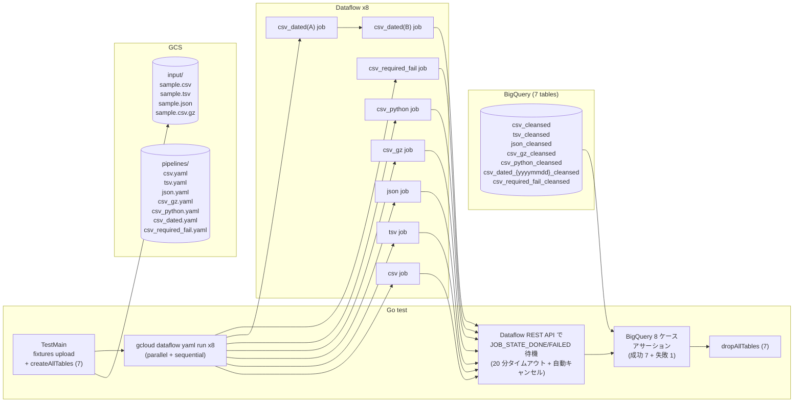
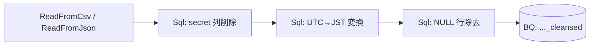

## はじめに

Google Cloud は **データ系のマネージドサービスが非常に多い**一方で、**GUI ベースで完結するもの** は意外と少ない。GUI 中心のサービスで代表的なのは **Cloud Data Fusion** だが、こちらは **常時インスタンスが動き続ける料金モデル** (Developer エディションでも月額 $300+ レンジ) なので、小規模な組織や検証フェーズでは手が出しづらい。

一方、**Dataflow は本来「Python/Java の Beam SDK でガッツリ書くサービス」** という印象が強いものの、最近は Cloud Console 上で **パイプラインを GUI で組み立てる機能** (Job Builder) が増えていて、「どこまで GUI で済ませられるか」が実のところ自分でもよく分かっていなかった。そこで今回、実際に手を動かして検証してみたのがこの記事の出発点。

検証を始めてすぐに分かったのは、Dataflow には **実装レベルが複数段あり**、用途に応じて選べる、ということ。具体的にはざっくり以下のレベルがある。

1. **完全 GUI (Google 提供テンプレート)**: Cloud Console から Google が用意した Dataflow テンプレートを選んで、パラメータを入力するだけで動く。コードは 1 行も書かない
2. **GUI + 宣言 (Dataflow Job Builder + Beam YAML)**: Cloud Console の Job Builder でドラッグ & ドロップしてパイプラインを組む。GUI で作ったものを Beam YAML としてエクスポート / インポートできる。**ローコード**と呼べる層
3. **YAML + 部分的な Python (Beam YAML + インライン Python)**: Beam YAML の中に `MapToFields` / `Filter` / `PyTransform` として **Python スクリプトをそのまま埋め込める**。Docker ビルドは不要だがロジックは自由に書ける
4. **フル SDK (Custom Flex Template + Docker)**: Python/Java で Beam パイプラインを 1 から書いて、Docker イメージとして Artifact Registry に置いて Flex Template として起動する。最も自由だが、最もヘビー

一つの GCS→BQ のクレンジングジョブでも、これらの **どのレベルでも実装可能**。ただし「どのレベルだと何ができて、何ができないのか」はドキュメントを読むだけでは掴みきれなかった。

そこで **今回は 1 と 2 と 3、つまり GUI + Beam YAML (+ 必要なら YAML 内のインライン Python) だけでどこまで頑張れるか** を深掘りすることにした。4 のフル SDK ルートは「最終手段としていつでも降りられる」ことが分かっているので、今回は敢えて意図的に選ばない。

### この記事で検証すること

具体的な検証範囲:

- Python ファイルは 1 行も書かない (インライン Python は除く)
- Dockerfile は書かない、ビルドしない、Artifact Registry も使わない
- パイプライン定義は **Beam YAML 1 ファイル = 1 ジョブ**
- 入力ファイルは CSV / TSV / NDJSON / gzip 圧縮 CSV の 4 種
- 変換は Sql ノード (Calcite SQL) と インライン Python (`MapToFields` / `Filter` / `PyTransform`) の両方を試す
- クレンジングは「カラム削除 + UTC→JST + NULL 行除去」を **1 本のパイプラインで直列チェーン**
- 正常系 7 ケース + 失敗系 1 ケース (計 8) で、NULLABLE 制約の構造的制限も検証

これを Terraform + Go テストで宣言的に検証した。

ソースは [`samplecodes/dataflow-gcs-to-bq/`](https://github.com/katonium/articles/tree/main/samplecodes/dataflow-gcs-to-bq) に置いてある。

## 結論

| 検証項目 | 結果 |
|---|---|
| CSV を Beam YAML だけで読める | ✅ `ReadFromCsv` でそのまま |
| TSV を Beam YAML だけで読める | ✅ `ReadFromCsv` の `delimiter: "\t"` |
| NDJSON を Beam YAML だけで読める | ✅ `ReadFromJson` の `lines: true` |
| gzip CSV を Beam YAML だけで読める | ✅ `ReadFromCsv` の `compression: gzip` |
| 3 つの変換 (カラム削除 + UTC→JST + NULL 除去) を直列チェーンできる | ✅ Read → Sql → Sql → Write の 1 本チェーンで動く |
| インライン Python で同じチェーンが書ける | ✅ `MapToFields` + `PyTransform` + `Filter` のチェーン |
| BQ テーブルが REQUIRED スキーマだと LOAD が失敗する | ✅ Beam YAML の pandas ベース推論は全非 PK 列を NULLABLE にするため、REQUIRED テーブルに書くと `JOB_STATE_FAILED` |
| Docker イメージのビルドが必要か | ❌ **不要**。Google が提供する YAML runner が動く |
| Artifact Registry が必要か | ❌ 不要 |
| Terraform から `gcloud dataflow yaml run` で起動できるか | ✅ Go テスト経由で `exec.Command` |

つまり**「GUI から SQL を書いて CSV を BQ に入れる」というレベルでやりたいことは、Beam YAML だけで 4 つのファイル形式のクレンジングチェーンが実現できる**。Python はインライン化できる範囲なら追加の Docker 環境なしに同居できる。ただし **Beam YAML (pandas 経由) のスキーマ推論は非 PK 列を一律 NULLABLE にする** ため、BQ 側のテーブルが REQUIRED スキーマだと LOAD が拒否される構造的制約がある。

## Dataflow の「実装レベル」を並べて眺める

冒頭で触れた 4 段のレイヤーを、表でもう少し具体的に並べておく。このうち A / B / C が今回の検証対象。

| レベル | 何を書く | Docker ビルド | SQL 変換 | Python 変換 | 主な用途 |
|---|---|:---:|:---:|:---:|---|
| **A. Google 提供テンプレート** | Console からパラメータをポチポチ | ❌ | ❌ (UDF は JS/Python のみ) | JS または Python UDF (1 関数) | 決まった入出力を流すだけ、とにかく早く動かしたい |
| **B. Dataflow Job Builder** | Console GUI でドラッグ&ドロップ | ❌ | ✅ Sql ノード | ✅ MapToFields / Filter の `language: python` | 組織内の非エンジニアにも触ってもらえる GUI 中心の運用 |
| **C. Beam YAML** | YAML ファイル (Job Builder からエクスポート可能) | ❌ | ✅ Sql ノード | ✅ MapToFields / Filter / PyTransform | リポジトリでバージョン管理したい、CI から実行したい |
| **D. Custom Beam SDK + Flex Template** | Python/Java で Beam パイプラインを自分で書く | ✅ (Dockerfile 必須) | ✅ `SqlTransform` (cross-language, JRE 必要) | ✅ フルに書ける | 既存 Python/Java 資産を使いたい、任意のライブラリを持ち込みたい |

**B と C は往復できる関係**。Job Builder で GUI から組み始めて、エクスポートされた Beam YAML をリポジトリに置き、後は CI で `gcloud dataflow yaml run` を叩く、という運用がきれい。今回の検証ではリポジトリ + CI 運用を想定して C を主軸に据えつつ、C から少し外に踏み出したときに何ができるか (TSV や gzip、そしてインライン Python) も確認している。

D (Custom Flex Template) は今回の検証範囲から意図的に外している。理由は 2 つ:

1. **前提としていた「重さ」を実感するため、一度 D ルートで実装したことがある**: SqlTransform が cross-language なので Dockerfile に JRE を入れる必要があり、Cloud Build + Artifact Registry のセットアップも絡み、「とりあえず動かしたい」までの心理的距離が遠い。これは「**ちょっとクレンジングして BQ に入れたい**」という今回の要件に対しては明らかに過剰
2. **B / C で足りないケースが出てきたら、そのときに D に降りれば良い**: レイヤーは下に降りる方向の移行はいつでもできる。先に下から始めてしまうと、上のレベルで足りたはずの要件まで下のコストを払うことになる

なので今回は **「上のレベルから順に試して、必要になるまで下に降りない」** という立場で検証している。

## 検証環境

### 全体像



### 1 本の YAML パイプラインの中身

各 YAML パイプラインは 3 つの変換を **直列にチェーン** して、1 つの BQ テーブルに書き込む。



出力スキーマは `{ id INT64, name STRING NULLABLE, event_at_jst TIMESTAMP NULLABLE }` で統一。入力 5 行から secret 列を落とし、UTC→JST 変換し、name が NULL の 2 行を除去して、最終的に 3 行 (id 1, 2, 4) が BQ に入る。

`csv_python.yaml` のみ Sql ノードの代わりに `MapToFields` + `PyTransform` + `Filter` のチェーンを使う。

## テストケース

入力データは全フォーマット共通の 5 行。

| id | name | secret | event_at_utc |
|---|---|---|---|
| 1 | Alice | foo | 2026-04-10 01:00:00 |
| 2 | Bob | bar | 2026-04-10 15:30:00 |
| 3 | _NULL_ | baz | 2026-04-10 10:00:00 |
| 4 | Dave | qux | 2026-04-10 23:00:00 |
| 5 | _NULL_ | quux | 2026-04-10 05:00:00 |

チェーン変換の内容:

| ステップ | 仕様 |
|---|---|
| 1. secret 列削除 | `secret` 列を SELECT から除外 |
| 2. UTC→JST | `event_at_utc` を UTC+9 して `event_at_jst` にリネーム |
| 3. NULL 行除去 | `name` が NULL の行を除去 |

最終出力: 3 行 (id 1, 2, 4)、スキーマ `{ id INT64, name STRING NULLABLE, event_at_jst TIMESTAMP NULLABLE }`

検証ケースの内訳:

| パイプライン | 入力 | 変換方式 | 期待結果 |
|---|---|---|---|
| csv.yaml | sample.csv | Sql チェーン | 成功: 3 行 |
| tsv.yaml | sample.tsv | Sql チェーン | 成功: 3 行 |
| json.yaml | sample.json (NDJSON) | Sql チェーン | 成功: 3 行 |
| csv_gz.yaml | sample.csv.gz | Sql チェーン | 成功: 3 行 |
| csv_python.yaml | sample.csv | MapToFields + PyTransform + Filter チェーン | 成功: 3 行 |
| csv_dated.yaml (Mode A) | sample_{yyyymmdd}.csv | Sql チェーン (明示パラメータ) | 成功: 3 行 |
| csv_dated.yaml (Mode B) | sample_{yyyymmdd}.csv | Sql チェーン (Jinja 変数なし、自動日付) | 成功: 3 行 |
| csv_required_fail.yaml | sample.csv | Sql チェーン → REQUIRED スキーマテーブル | **失敗: JOB_STATE_FAILED** |
| **合計** | | | **8** |

`csv_dated.yaml` は 1 本の YAML ファイルで 2 つの運用モード (A/B) をカバーする。詳細は後述の「動的な日付: 1 本の YAML で 2 つのモード」を参照。

`csv_required_fail.yaml` は意図的な失敗テスト。Beam YAML の pandas ベーススキーマ推論が非 PK 列を一律 NULLABLE にすることを、REQUIRED スキーマのテーブルへの書き込み失敗で証明する。詳細は後述の「失敗テスト: REQUIRED 制約」を参照。

## 実装

### Beam YAML パイプライン (SQL 版)

`csv.yaml` の全文は短い。Read → Sql (secret 削除 + UTC→JST) → Sql (NULL 除去) → Write の直列チェーン。

```yaml
pipeline:
  type: composite
  transforms:
    - type: ReadFromCsv
      name: Read
      config:
        path: "{{ input_path }}"

    - type: Sql
      name: DropSecretAndConvertTZ
      input: Read
      config:
        query: |
          SELECT
            CAST(id AS BIGINT) AS id,
            name,
            TIMESTAMPADD(HOUR, 9, CAST(event_at_utc AS TIMESTAMP)) AS event_at_jst
          FROM PCOLLECTION

    - type: Sql
      name: FilterNullNames
      input: DropSecretAndConvertTZ
      config:
        query: |
          SELECT id, name, event_at_jst
          FROM PCOLLECTION
          WHERE name IS NOT NULL

    - type: WriteToBigQuery
      name: Write
      input: FilterNullNames
      config:
        table: "{{ project }}.{{ dataset }}.{{ prefix }}_cleansed"
        create_disposition: CREATE_NEVER
        write_disposition: WRITE_APPEND
```

ポイントは以下。

- **`{{ input_path }}` などは Jinja2 変数**。`gcloud dataflow yaml run --jinja-variables='{"input_path":"gs://..."}'` で実行時に注入される
- **Sql ノードの `query` は Calcite SQL** (Beam SQL)。`PCOLLECTION` は入力 PCollection を指す予約語
- **1 つ目の Sql で secret 列の除外と UTC→JST 変換を同時に行い**、2 つ目の Sql で NULL 行を除去する。旧設計では 3 ブランチに分岐していたが、実務では「全部やってから 1 テーブルに書く」方が自然なので直列チェーンに変更した
- **`CAST(event_at_utc AS TIMESTAMP)`** が必要なのは、`ReadFromCsv` が pandas 経由で読むため `event_at_utc` が string として入ってくるから。BQ の TIMESTAMP 列に書く前に SQL 上で型を合わせる
- **JST 変換は `TIMESTAMPADD(HOUR, 9, ...)`** で素直に。`CONVERT_TIMEZONE` などのタイムゾーン関数はランナー依存で安定しないので避ける
- **`WriteToBigQuery` の `create_disposition: CREATE_NEVER`** で「テーブルは Go テストが事前に作っていることを前提にする」と宣言する。書き込みは `WRITE_APPEND` で、テスト前後の TRUNCATE は Go 側に任せる

TSV / gzip CSV / NDJSON の YAML は ReadFromCsv の引数だけが違う。

```yaml
# tsv.yaml
- type: ReadFromCsv
  config:
    path: "{{ input_path }}"
    delimiter: "\t"

# csv_gz.yaml
- type: ReadFromCsv
  config:
    path: "{{ input_path }}"
    compression: gzip

# json.yaml
- type: ReadFromJson
  config:
    path: "{{ input_path }}"
    lines: true
```

`ReadFromCsv` は内部で pandas の `read_csv` を呼んでいて、`delimiter` も `compression` も `**kwargs` 経由でそのまま渡る。NDJSON も pandas の `read_json(lines=True)` 相当が動く。**Job Builder GUI には TSV と gzip の選択肢が出ないが、エクスポートされた YAML を 1 行いじるだけで対応できる**、というのが GUI と YAML の関係の良いところ。

### インライン Python 版 (`csv_python.yaml`)

「Beam YAML だけど Python も書きたい」というケースの最小デモ。SQL 版と同じ直列チェーンを、3 種類の Python 書き方で構成している。

```yaml
pipeline:
  type: composite
  transforms:
    - type: ReadFromCsv
      name: Read
      config:
        path: "{{ input_path }}"

    # 1. MapToFields の language: python (secret 列を除外)
    - type: MapToFields
      name: PyDropSecret
      input: Read
      config:
        language: python
        fields:
          id: id
          name: name
          event_at_utc: event_at_utc

    # 2. PyTransform の __callable__ (UTC→JST 変換)
    - type: PyTransform
      name: PyUtcJst
      input: PyDropSecret
      config:
        constructor: __callable__
        kwargs:
          source: |
            def transform(pcoll):
              import apache_beam as beam
              from datetime import datetime, timedelta

              def to_jst(row):
                utc = datetime.strptime(row.event_at_utc, "%Y-%m-%d %H:%M:%S")
                jst = utc + timedelta(hours=9)
                return beam.Row(
                  id=row.id,
                  name=row.name,
                  event_at_jst=jst.strftime("%Y-%m-%d %H:%M:%S"),
                )

              return pcoll | "ToJst" >> beam.Map(to_jst)

    # 3. Filter の language: python (NULL 行除去)
    - type: Filter
      name: PyNullDrop
      input: PyUtcJst
      config:
        language: python
        keep: "name is not None"

    - type: WriteToBigQuery
      name: Write
      input: PyNullDrop
      config:
        table: "{{ project }}.{{ dataset }}.{{ prefix }}_cleansed"
        create_disposition: CREATE_NEVER
        write_disposition: WRITE_APPEND
```

3 つの書き方を直列チェーンの各ステップに配置した。

- **`MapToFields` の `language: python`**: 列ごとに Python 式を書く。`fields:` に列挙したフィールドだけが残るので「列削除」もこれでできる。1 行で済む変換に向いている
- **`PyTransform` の `__callable__`**: import が必要だったり数行のロジックがあるときはこれ。`source:` に Python のスクリプトをそのまま書ける。`def transform(pcoll):` のような関数が `PCollection -> PCollection` の PTransform として使われる
- **`Filter` の `language: python`**: 1 行の Python 述語で行を絞る

**重要なのは、これでも Docker ビルドは一切ないこと**。Google が提供する Dataflow の YAML runner Flex Template にはすでに Python ランタイムが入っているので、`source:` のコードがワーカー側で `exec` される形で動く。標準ライブラリの範囲なら追加のパッケージ指定もいらない。

### 失敗テスト: REQUIRED 制約 (`csv_required_fail.yaml`)

Beam YAML の pandas ベーススキーマ推論がもたらす構造的制約を証明するための意図的な失敗テスト。

`csv_required_fail.yaml` は `csv.yaml` と同じチェーン構造だが、宛先テーブルのスキーマが異なる。Go テスト側で `name STRING REQUIRED` のテーブルを作成し、そこに NULLABLE データを書き込ませる。

```yaml
# csv_required_fail.yaml (csv.yaml と同じチェーン、宛先だけが REQUIRED スキーマテーブル)
pipeline:
  type: composite
  transforms:
    - type: ReadFromCsv
      name: Read
      config:
        path: "{{ input_path }}"

    - type: Sql
      name: DropSecretAndConvertTZ
      input: Read
      config:
        query: |
          SELECT
            CAST(id AS BIGINT) AS id,
            name,
            TIMESTAMPADD(HOUR, 9, CAST(event_at_utc AS TIMESTAMP)) AS event_at_jst
          FROM PCOLLECTION

    - type: Sql
      name: FilterNullNames
      input: DropSecretAndConvertTZ
      config:
        query: |
          SELECT id, name, event_at_jst
          FROM PCOLLECTION
          WHERE name IS NOT NULL

    - type: WriteToBigQuery
      name: Write
      input: FilterNullNames
      config:
        table: "{{ project }}.{{ dataset }}.{{ prefix }}_cleansed"
        create_disposition: CREATE_NEVER
        write_disposition: WRITE_APPEND
```

パイプライン自体は正常なデータ (NULL 行は除去済み) を出力するが、**Beam YAML (pandas 経由) のスキーマ推論が `name` 列を NULLABLE として BQ に送る**ため、BQ 側の REQUIRED 制約と衝突して LOAD が失敗する。Go テスト側では `JOB_STATE_FAILED` を期待値としてアサーションする。

この失敗テストで分かること:

- **Beam YAML の pandas ベース推論は非 PK 列を一律 NULLABLE にする**。データの中身に NULL がなくても、スキーマレベルで NULLABLE が付く
- **BQ テーブルが REQUIRED スキーマの場合、パイプライン側でデータを完璧にクレンジングしても LOAD は拒否される**。これは Beam YAML の構造的制約
- **対策は BQ テーブル側を NULLABLE にすること**。REQUIRED 制約が必要な場合は、BQ のテーブル制約 (column-level constraints) や後段のバリデーションで担保する設計にする

### 動的な日付: 1 本の YAML で 2 つのモード (`csv_dated.yaml`)

よくある実務要件: 入力ファイル名とBigQuery 宛先テーブル名に **日付 (yyyymmdd)** を埋め込みたい。例えば `sample_20260411.csv` を読んで `csv_dated_20260411_drop_col` に書き込む、というパターン。日次バッチや日別パーティションの運用でよくある形。

この「日付」をどう決めるかには 2 つの流儀がある。

- **(A) 明示パラメータ**: 呼び出し側が日付を決めて渡す。バックフィルや特定日の再処理で必要
- **(B) 起動時の現在日付**: Dataflow 側が「今日」を自動で取得する。Cloud Scheduler で日次回転させたい用途

Beam YAML ならこれを **1 本の YAML ファイルで両対応** できる。Jinja2 の `` と `is defined` test、そして **Beam YAML が Jinja コンテキストに公式に公開している `datetime` モジュール** を使う。

```yaml
{# yyyymmdd が渡されていればそれを、なければ launcher VM の今日を採用 #}
{% set yyyymmdd = yyyymmdd if yyyymmdd is defined
                  else datetime.datetime.now().strftime('%Y%m%d') %}

pipeline:
  type: composite
  transforms:
    - type: ReadFromCsv
      name: Read
      config:
        path: "{{ input_path_prefix }}/sample_{{ yyyymmdd }}.csv"

    - type: Sql
      name: DropSecretAndConvertTZ
      input: Read
      config:
        query: |
          SELECT
            CAST(id AS BIGINT) AS id,
            name,
            TIMESTAMPADD(HOUR, 9, CAST(event_at_utc AS TIMESTAMP)) AS event_at_jst
          FROM PCOLLECTION

    - type: Sql
      name: FilterNullNames
      input: DropSecretAndConvertTZ
      config:
        query: |
          SELECT id, name, event_at_jst
          FROM PCOLLECTION
          WHERE name IS NOT NULL

    - type: WriteToBigQuery
      name: Write
      input: FilterNullNames
      config:
        table: "{{ project }}.{{ dataset }}.csv_dated_{{ yyyymmdd }}_cleansed"
        create_disposition: CREATE_NEVER
        write_disposition: WRITE_APPEND
```

ポイント:

- **``** で自己参照的に値を設定している。`yyyymmdd` が未定義なら `is defined` が False を返し、else 側の `datetime.datetime.now().strftime('%Y%m%d')` が評価される。定義済みなら渡された値をそのまま使う
- **`datetime` モジュールは Beam YAML の Jinja コンテキストに最初から入っている**。Beam YAML のドキュメントにも明記されている (`"We also expose the datetime module as a variable by default"`)。追加のセットアップなしに `datetime.datetime.now()` / `datetime.date.today()` / `datetime.timedelta(...)` が使える
- **path と table の両方で `{{ yyyymmdd }}` を再利用している**ので、ファイル名と BQ テーブル名が必ず同じ日付に揃う
- **`input_path_prefix`** だけを外から渡して、ファイル名は YAML 内で組み立てる。こうすることで Mode B (launcher VM が日付を決める) でも path が自動で同じ日付になる

#### 呼び出し側の使い分け

```bash
# (A) 明示パラメータ: バックフィル用途
gcloud dataflow yaml run csv-dated-backfill \
  --yaml-pipeline-file=gs://.../pipelines/csv_dated.yaml \
  --jinja-variables='{"yyyymmdd":"20260101", "input_path_prefix":"gs://bucket/input", "project":"...", "dataset":"..."}' \
  ...

# (B) 自動計算: 日次バッチ用途 (yyyymmdd を渡さない)
gcloud dataflow yaml run csv-dated-daily \
  --yaml-pipeline-file=gs://.../pipelines/csv_dated.yaml \
  --jinja-variables='{"input_path_prefix":"gs://bucket/input", "project":"...", "dataset":"..."}' \
  ...
```

**本検証では両モードを実走して同じ結果になることを確認した**。Go test は:

1. `today = time.Now().UTC().Format("20060102")` で「今日」を計算
2. `sample_{today}.csv` を GCS にアップロード
3. dated テーブル (`csv_dated_{today}_cleansed`) を Go が BigQuery API で動的に作成
4. Mode A: 他のジョブと一緒に並列でキック (`yyyymmdd=today` を jinja 変数で渡す)
5. 成功ケースのアサーションをパス (3 行、id 1/2/4)
6. dated テーブルを TRUNCATE して、Mode B (jinja 変数なし) で同じ YAML を再実行
7. 同じテーブルに対して同じ期待値でアサーションをパス
8. dated テーブルを Go が drop、`sample_{today}.csv` も削除

#### タイムゾーンの罠

`datetime.datetime.now()` は **launcher VM のローカル時刻** (= 通常 UTC) を返す。JST 基準の「今日」が必要な場合、素直に (A) モードで JST の日付を caller 側で計算して渡すのが安全。どうしても YAML 側で JST を使いたければ:

```yaml
{% set yyyymmdd = (datetime.datetime.now() + datetime.timedelta(hours=9)).strftime('%Y%m%d') %}
```

と書けばいい (UTC に +9h して JST 相当にずらす)。ただし DST の概念がある地域だと危ういので、**タイムゾーンが絡む日付は caller 側で決める** のが無難。

#### 全テーブルを Go が管理する理由

**全 7 テーブルを Go test が `createAllTables` で作成し、`dropAllTables` で削除する**。旧設計では静的テーブルを Terraform が管理していたが、以下の理由で Go に統一した:

- **dated テーブルの名前が実行時まで決まらない**: 「今日」は Terraform apply 時点ではなく test 実行時点で決める方が再現性が高い
- **Terraform の timestamp() は state churn を起こす**: `formatdate("YYYYMMDD", timestamp())` を local に入れると、plan のたびに差分が出てしまう
- **テーブルが 7 つに減って管理が単純になった**: 3 ブランチ × 5 フォーマット = 15 テーブルだったのが、1 チェーン × 1 テーブルになったことで Terraform の `for_each` の必要性がなくなった
- **per-run リソースの管轄は Go**: 元々の責務分離 ("Terraform = 長生き / Go = 一過性") に合致する

実装は `bigquery.Client.Dataset().Table().Create()` と `.Delete()` の単純呼び出しで済む。

### Terraform: シンプルになった構成

Custom Flex Template ルートのときは Artifact Registry / Cloud Build / null_resource / Dockerfile build trigger を Terraform に詰め込む必要があった。Beam YAML ルートでは全部消えて、リソースは下記だけになる。

```hcl
# GCS バケット
resource "google_storage_bucket" "workspace" { ... }

# Beam YAML を GCS にアップロード
resource "google_storage_bucket_object" "yaml_pipelines" {
  for_each = local.yaml_files
  name     = "pipelines/${each.key}.yaml"
  bucket   = google_storage_bucket.workspace.name
  source   = each.value
}

# BigQuery dataset (テーブルは Go テストが管理)
resource "google_bigquery_dataset" "verification" { ... }

# Dataflow ワーカー SA + IAM
resource "google_service_account" "dataflow_worker" { ... }
resource "google_project_iam_member" "worker_dataflow" { ... }
# (他の IAM)

# テスト実行ユーザがこの SA を使えるよう serviceAccountUser を付与
resource "google_service_account_iam_member" "runner_can_actas_worker" {
  service_account_id = google_service_account.dataflow_worker.name
  role               = "roles/iam.serviceAccountUser"
  member             = "user:${data.google_client_openid_userinfo.me.email}"
}
```

**BQ テーブルは全て Go テストが管理する**。旧設計では Terraform が 15 個の静的テーブルを `for_each` で作成していたが、テーブル数が 7 に減り、かつ一部 (dated テーブル) は名前が実行時まで決まらないため、**全テーブルを Go 側の `createAllTables` / `dropAllTables` に統一した**。Terraform はバケット、データセット、SA、IAM、YAML ファイルのアップロードという長生きリソースだけを管轄する。

### Go テスト: `gcloud dataflow yaml run` を exec.Command する

Dataflow REST API の `dataflow.projects.locations.flexTemplates.launch` 経由で YAML runner を起動することもできるが、`gcloud dataflow yaml run` を使った方が Jinja 変数の渡し方や `--service-account-email` まわりの面倒が少ない。Go テストからは `exec.Command` で gcloud を叩いて、`--format=json` で job ID を拾う。

```go
func launchYamlPipeline(t *testing.T, tf *tfOutput, format string) (string, error) {
    yamlPath := tf.YamlPipelineGCSPaths[format]
    inputPath := fmt.Sprintf("gs://%s/%s", tf.BucketName, formatToInputObject[format])

    jinjaVars, _ := json.Marshal(map[string]string{
        "input_path": inputPath,
        "project":    tf.ProjectID,
        "dataset":    tf.DatasetID,
        "prefix":     format,
    })

    args := []string{
        "dataflow", "yaml", "run", fmt.Sprintf("df-gcs-to-bq-%s-%d", format, time.Now().Unix()),
        "--yaml-pipeline-file", yamlPath,
        "--region", tf.Region,
        "--service-account-email", tf.DataflowWorkerSAEmail,
        "--temp-location", fmt.Sprintf("gs://%s/temp/", tf.BucketName),
        "--staging-location", fmt.Sprintf("gs://%s/staging/", tf.BucketName),
        "--jinja-variables", string(jinjaVars),
        "--project", tf.ProjectID,
        "--format", "json",
    }
    cmd := exec.Command("gcloud", args...)
    var stdout, stderr bytes.Buffer
    cmd.Stdout = &stdout
    cmd.Stderr = &stderr
    if err := cmd.Run(); err != nil {
        return "", fmt.Errorf("gcloud yaml run failed: %w\nstderr: %s", err, stderr.String())
    }

    var out struct{ ID string `json:"id"` }
    if err := json.Unmarshal(stdout.Bytes(), &out); err != nil {
        return "", err
    }
    return out.ID, nil
}
```

ジョブの完了待機は Dataflow REST API クライアント (`google.golang.org/api/dataflow/v1b3`) で `JOB_STATE_DONE` または `JOB_STATE_FAILED` をポーリング。**20 分のタイムアウトを設け、超過時は Dataflow API 経由でジョブをキャンセルしてコスト暴走を防ぐ**。

全テーブルの作成 (`createAllTables`) → ジョブ並列起動 → 全完了待ち → アサーション → テーブル削除 (`dropAllTables`) という流れ。`createAllTables` は 7 テーブル (成功 6 + 失敗テスト用 1) を BigQuery API で作成し、`dropAllTables` がテスト終了時に全て削除する。

アサーションは `assertCleansedResult` 関数に統一。BigQuery から `[]bigquery.Value` で受けて、`time.Time` や nil を正規化文字列化してから期待値スライスと完全一致を見る。

```go
// 全成功ケース共通: チェーン後の期待値 (3 行)
want := [][]string{
    {"1", "Alice", tsStr(plus9h(inputUTC[1]))}, // 2026-04-10 10:00:00
    {"2", "Bob", tsStr(plus9h(inputUTC[2]))},   // 2026-04-11 00:30:00
    {"4", "Dave", tsStr(plus9h(inputUTC[4]))},  // 2026-04-11 08:00:00
}
```

失敗テスト (`csv_required_fail`) のアサーションはジョブ状態で判定する。

```go
// 失敗テスト: JOB_STATE_FAILED を期待
state, err := waitForJob(ctx, dfClient, projectID, region, jobID, 20*time.Minute)
require.NoError(t, err)
assert.Equal(t, "JOB_STATE_FAILED", state)
```

`go test -v` を回すと 8 個の subtest が `format=csv` / `format=csv_required_fail` のような名前で並ぶ。

## 実行

```bash
export GOOGLE_CLOUD_PROJECT="your-project-id"

make init
make apply    # GCS / BQ / SA / YAML upload
make test     # Go テストで Dataflow ジョブ起動 → 8 ケース検証 (成功 7 + 失敗 1)
make destroy
```

## 番外編: Beam YAML で使える「最小ワーカー」を探す旅

Beam YAML 構成なら Custom Flex Template のような Docker ビルドコストがない分、ランニングコストはどこまで下げられるのか？というのが気になって、**ワーカーの machine type を極限まで小さくしたら何が起きるか** を実験した。結論から言うと「f1-micro は明確にダメ、g1-small は理屈上 OK だが実質動かず、結局 `n1-standard-1` が実質的な底値」となった。挙動の違いが面白かったので書いておく。

検証の動機は単純: t2-micro 系の無料枠的ノリで `f1-micro` / `g1-small` が使えたら最高、というもの。Cloud Console の UI 上ではこれらがワーカーの machine type として **選択可能** に見えていた。

### f1-micro: Dataflow の RAM 下限ゲートで即死

`--worker-machine-type=f1-micro` でジョブを投げると、**launcher は受け付けるが worker 起動フェーズで即 FAILED**。Cloud Logging に核心のエラーが出ていた。

```
ERROR   The minimum amount of memory of a Dataflow worker instance is 1740 MB.
        The machine type selected (f1-micro) only has 614 MB of memory.

WARNING Running Dataflow jobs with shared-core instance types
        (g1-small, f1-micro) is not officially supported.
```

要点:

- **Dataflow の hard gate は「CPU の種類」ではなく「RAM ≥ 1740 MB」である**。shared-core であること自体を理由に弾いているわけではなかった。f1-micro は 614 MB しかないので下限を大きく割って拒否された
- 一方で shared-core 系は公式には "not officially supported" という **警告** レベル。エラーではない
- つまり `e2-micro` (1 GB) も RAM 下限を下回るので確実に同じ理由でダメ

### g1-small: ゲートは通るが「在庫がない」で動かない

g1-small は **1.7 GB (= 1740 MB)** RAM で、Dataflow の下限ギリギリに張り付いている。まさにこの境界を越えるために設計されていそうな数字。試してみるとジョブは `JOB_STATE_RUNNING` まで進み、**Dataflow 側の RAM ゲートは通過した**。

ところが worker pool の起動フェーズで今度は Compute Engine 側のエラーに遭遇した。

```
ERROR   Startup of the worker pool in us-central1 failed to bring up any of the
        desired 1 workers. This is likely a quota issue or a Compute Engine stockout.

        ZONE_RESOURCE_POOL_EXHAUSTED: Instance '...' creation failed:
        The zone 'projects/spa-322704/zones/us-central1-b' does not have enough
        resources available to fulfill the request.
        Try a different zone, or try again later.
```

`us-central1-b` → `us-central1-f` → また `us-central1-b`… とゾーンを変えながら 10 回以上リトライされたが、**いずれのゾーンでも g1-small の在庫が確保できず**、最終的に FAILED になった。

- g1-small は **legacy / deprecation 予定** の machine type で、GCP 側がキャパシティをほぼ持っていない、というのが実態らしい
- **別リージョン (europe-west1 や asia-northeast1 など) であれば在庫があって動く可能性はある**。ただし今回検証した `us-central1` では少なくともこの時点で動かなかった
- ドキュメント通り "not officially supported" の warning も付いてくるので、**仮に動いても本番に使うべきではない**

「Dataflow ゲートは通っているのに Compute Engine の都合で動かない」という、二段構えの失敗の仕方は独特で面白かった。

### e2-small: 動くが、スキーマ不一致で失敗する場合がある

RAM 2 GB で Dataflow ゲートは確実に通る。shared-core 系なので g1-small と同じ warning は付くが、`e2` 系は現役世代なので stockout の問題はなく、ワーカーは起動する。

実際に検証した結果、**CPU starvation の警告は出る** (shared-core なので想定内) が、**致命的な失敗の原因は CPU ではなくスキーマ不一致だった**。Beam YAML の pandas ベース推論が非 PK 列を NULLABLE にするため、BQ テーブルが REQUIRED スキーマだと LOAD が拒否されて `JOB_STATE_FAILED` になる。これは machine type に関係なく `n1-standard-1` でも同じ結果になる構造的な問題で、上述の「失敗テスト: REQUIRED 制約」で詳しく検証した。

### 実質の底値

| machine-type | RAM | Dataflow ゲート | 実行可否 | 備考 |
|---|---|:---:|:---:|---|
| `f1-micro` | 614 MB | ❌ 拒否 | ❌ | Dataflow の最小 RAM 1740 MB を下回る |
| `e2-micro` | 1024 MB | ❌ 拒否 (未検証だが確実) | ❌ | 同上 |
| `g1-small` | 1740 MB | ✅ 通る | ❌ (us-central1) | stockout。リージョンによっては動くかも |
| `e2-small` | 2 GB | ✅ 通る | ✅ (CPU 警告あり) | shared-core なので公式非推奨。致命的失敗はスキーマ不一致 (REQUIRED vs NULLABLE) が原因で machine type 非依存 |
| `n1-standard-1` | 3.75 GB | ✅ 通る | ✅ | **実質の底値。これで十分** |

Dataflow の課金モデルは **vCPU 時間が支配的** で、machine type を変えても 1 vCPU のままならコスト差は小さい。つまり「5 行のテストデータを n1-standard-1 × 1 worker × 3 分」で **1 ジョブあたり $0.005 前後**。8 本走らせても $0.04〜0.08。ここからさらに削ることの意味は薄い。

### 学び

- **`f1-micro` や `e2-micro` が Console の UI に出ていても信じてはいけない**。Dataflow 側の hard gate で弾かれる
- **Dataflow の最小要件は「shared-core の否定」ではなく「RAM ≥ 1740 MB」**。これはドキュメントよりもエラーメッセージの方が具体的で分かりやすい
- **g1-small は理屈上 OK でも、実質的には使えない legacy リソース** になっている。Console に出るからといって動くとは限らない
- **結局 `n1-standard-1` (1 vCPU / 3.75 GB) が実質の底値**。ここに `--num-workers=1 --max-workers=1` を付けて autoscaling を潰せば、バッチ検証用のコストは誤差レベルに収まる

## わかったこと

- **Beam YAML だけで CSV / TSV / NDJSON / gzip CSV を BQ に投入できる**。`ReadFromCsv` は pandas の `read_csv` を内側で呼んでいるので、`delimiter` も `compression` も pandas の引数がそのまま使える。**Job Builder GUI に出てこない TSV / gzip も、エクスポートされた YAML に 1 行足すだけで動く**。GUI から始めて YAML で仕上げる、という現実的なフローと相性がいい
- **複数の変換を直列チェーンして 1 テーブルに書くのが自然な設計**。Read → Sql (secret 削除 + UTC→JST) → Sql (NULL 除去) → Write の 1 本チェーンで、実務的なクレンジングが完結する。旧設計の「変換ごとに分岐して別テーブルに書く」よりもシンプルで、テーブル数も大幅に減る
- **Sql ノードの Calcite SQL は実用に耐える**。`CAST` / `TIMESTAMPADD` / `WHERE` のような基本構文はそのまま動く。`CONVERT_TIMEZONE` などのタイムゾーン関数はランナー依存でハマりがちなので、**JST 変換は `TIMESTAMPADD(HOUR, 9, ...)` で素直に書く**のが安定する
- **インライン Python は 3 段階で書ける**: `MapToFields` の `language: python` は 1 行式、`Filter` の `language: python` は 1 行述語、`PyTransform` の `__callable__` は import 込みの完全な PTransform。Docker ビルドは一切いらない。これらを直列チェーンに組み合わせれば SQL 版と同等の変換が Python で書ける
- **Beam YAML (pandas 経由) のスキーマ推論は非 PK 列を一律 NULLABLE にする**。BQ テーブルが REQUIRED スキーマの場合、データの中身に NULL がなくても LOAD は拒否される。これは Beam YAML の構造的制約であり、対策は BQ テーブル側を NULLABLE にすること。REQUIRED 制約が必要な場合は BQ のテーブル制約や後段バリデーションで担保する
- **Custom Flex Template ルートで必要だったハードルが全部消える**: Dockerfile、JRE インストール、Cloud Build トリガー、Artifact Registry のリポジトリ管理、`SqlTransform` cross-language の苦労、`save_main_session` の罠… これらは「Python をフルに書きたい」要件があって初めて意味を持つ。**「SQL がちょっと書ける程度のデータ担当者」が CSV を BQ に入れたいなら、Beam YAML を選ぶのが正しい**
- **検証ワークスペースは責務を完全に切ると読みやすくなる**。Terraform = インフラ + YAML upload、Go = テーブル管理 + 検証ロジック、Beam YAML = 純粋な ETL 宣言。全テーブルを Go 側の `createAllTables` / `dropAllTables` に統一することで、Terraform は長生きリソースだけに集中できる
- **動的な日付は 1 本の YAML で 2 モード対応できる**: `{% set yyyymmdd = yyyymmdd if yyyymmdd is defined else datetime.datetime.now().strftime('%Y%m%d') %}` という Jinja2 の条件分岐 + Beam YAML が公開する `datetime` モジュールの組み合わせで、「パラメータで明示 or 起動時に自動計算」を切り替えられる。バックフィル (明示) と日次バッチ (自動) の両方の運用が同じ YAML で回せる
- **Dataflow worker の最小 machine type は RAM で決まる**: hard gate は `RAM ≥ 1740 MB`。`f1-micro` / `e2-micro` は選択可能に見えても RAM 下限で拒否される。`g1-small` は RAM ゲートを通るが legacy 扱いで実質 stockout、`us-central1` では在庫が取れなかった。結局 `n1-standard-1` (1 vCPU / 3.75 GB) が実質の底値。詳細は上の「番外編」セクション参照
- **タイムアウト + 自動キャンセルでコスト暴走を防ぐ**: `waitForJob` に 20 分タイムアウトを設け、超過時は Dataflow API 経由でジョブをキャンセルする。検証ジョブは通常 3-5 分で終わるが、万一ハングした場合にワーカーが課金され続けるのを防ぐ安全装置

## おわりに

最初に書いた通り、Google Cloud のデータ系サービスには GUI ベースのものが意外と少なく、Data Fusion は常時課金で手が出しづらく、Dataflow の GUI 機能はどこまで使えるかよく分かっていなかった。その疑問に対する今回の答えはシンプルで、**「CSV をちょっとクレンジングして BigQuery に入れる」程度の用途なら、GUI (Job Builder) + Beam YAML + 必要に応じてインライン Python、の範囲で十分に足りる**。Docker も Artifact Registry も Cloud Build も要らない。

**どのレベルで実装すべきかは要件次第** という当たり前の結論になるが、今回の検証で **レベルの境界線** がだいぶクリアに見えた:

| 要件 | 必要なレベル |
|---|---|
| 決まった入出力を流すだけ (パラメータだけ変えたい) | A. Google 提供テンプレート |
| 非エンジニアが Console で組み立てたい | B. Dataflow Job Builder |
| リポジトリでバージョン管理したい、CI で回したい | C. Beam YAML |
| 既存の Python ライブラリ資産を持ち込みたい、cross-language で SqlTransform を Python から呼びたい | D. Custom Flex Template |

今回の `samplecodes/dataflow-gcs-to-bq/` で実装したのは C を主軸に、複数の変換を直列チェーンし、インライン Python (`MapToFields` / `Filter` / `PyTransform`) も組み合わせられる、という境界の確認。加えて Beam YAML の pandas ベーススキーマ推論が NULLABLE を一律付与する構造的制約も、失敗テストで明確に示した。この境界を越えたい (例えば `pytz` などの外部パッケージを入れたい、スキーマを完全制御したい、複数ファイルに分けて書きたい) 場合に初めて D に降りれば良い、という運用指針が立つ。

**「作るな、宣言しろ」** という Beam YAML の哲学と、**「必要になるまで下のレベルに降りない」** という運用指針が、Dataflow を使う組織としては一番コストパフォーマンスが良い出発点だと思う。Data Fusion の常時課金に引け目を感じつつも、かといって Python + Docker のフルルートに飛び込むのは重い、という状況に置かれているなら、まず B/C から始めることをおすすめしたい。

ソースは [`samplecodes/dataflow-gcs-to-bq/`](https://github.com/katonium/articles/tree/main/samplecodes/dataflow-gcs-to-bq)。
