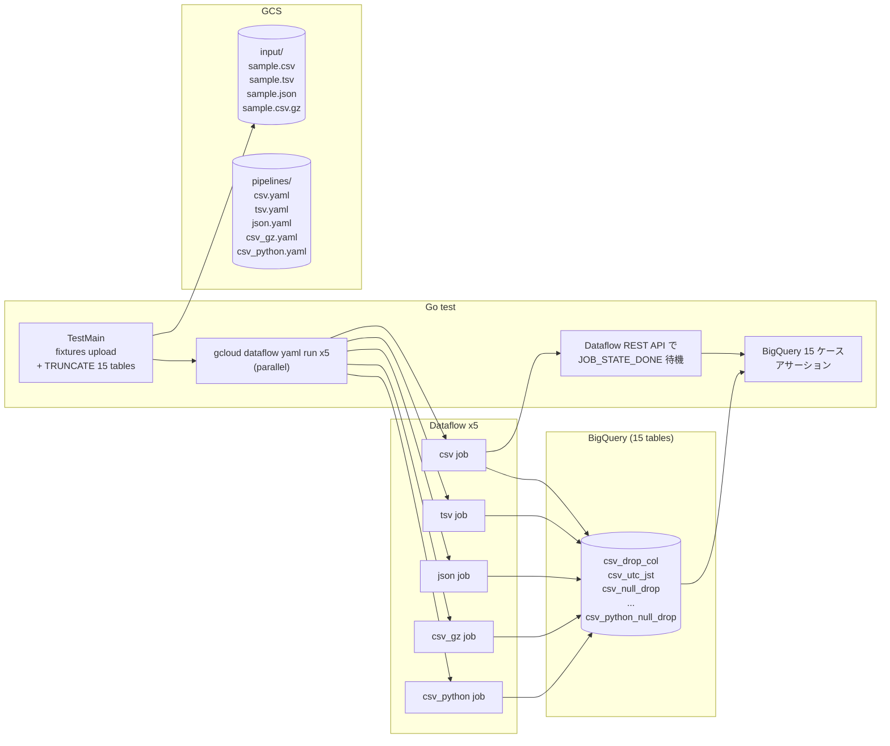
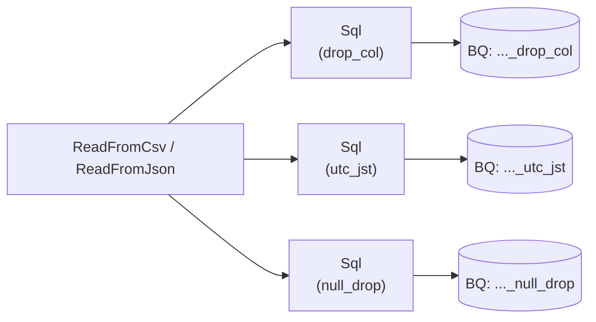

## はじめに

「Dataflow で GCS のファイルをちょっとクレンジングして BigQuery に投入したい」というユースケースは、本当によくある。ところがいざやろうとすると、ドキュメントの入口がいくつもあって戸惑う。

- カスタム Beam パイプラインを Python/Java で書いて、Flex Template として Docker でパッケージングしてデプロイする
- Google が提供してる "Cloud Storage Text to BigQuery" などのテンプレートに JavaScript や Python の UDF を渡す
- Cloud Console GUI で **Dataflow Job Builder** を使ってパイプラインをドラッグ & ドロップで組む
- **Beam YAML** で宣言的にパイプラインを書いて `gcloud dataflow yaml run` で投げる

このうち一番ヘビーなのが「カスタム Beam パイプラインを Docker で」のルート。一番ライトなのが「Job Builder / Beam YAML」のルート。**今回は後者でどこまで書けるかを検証する**。具体的には:

- Python ファイルは 1 行も書かない (インライン Python は除く)
- Dockerfile は書かない、ビルドしない、Artifact Registry も使わない
- パイプライン定義は **Beam YAML 1 ファイル / 1 ジョブ**
- 入力ファイルは CSV / TSV / JSON / gzip 圧縮 CSV の 4 種
- 変換は SQL ノード (Calcite SQL) と インライン Python の両方を試す

これを Terraform + Go テストで宣言的に検証した。

ソースは [`samplecodes/dataflow-gcs-to-bq/`](https://github.com/katonium/articles/tree/main/samplecodes/dataflow-gcs-to-bq) に置いてある。

## 結論

| 検証項目 | 結果 |
|---|---|
| CSV を Beam YAML だけで読める | ✅ `ReadFromCsv` でそのまま |
| TSV を Beam YAML だけで読める | ✅ `ReadFromCsv` の `delimiter: "\t"` |
| NDJSON を Beam YAML だけで読める | ✅ `ReadFromJson` の `lines: true` |
| gzip CSV を Beam YAML だけで読める | ✅ `ReadFromCsv` の `compression: gzip` |
| Sql ノードでカラム削除 / TZ 変換 / NULL 行除去が書ける | ✅ Calcite SQL で素直に書ける |
| インライン Python で同じ変換が書ける | ✅ `MapToFields` / `Filter` / `PyTransform` で書ける |
| Docker イメージのビルドが必要か | ❌ **不要**。Google が提供する YAML runner が動く |
| Artifact Registry が必要か | ❌ 不要 |
| Terraform から `gcloud dataflow yaml run` で起動できるか | ✅ Go テスト経由で `exec.Command` |

つまり**「GUI から SQL を書いて CSV を BQ に入れる」というレベルでやりたいことは、Beam YAML だけで 4 つのファイル形式 × 3 種類のクレンジングのほぼ全部が実現できる**。Python はインライン化できる範囲なら追加の Docker 環境なしに同居できる。

## なぜそうしたいのか

そもそも私は「Python をガッツリ書いて Custom Flex Template を Docker でビルドする」ルートで一度実装した。そっちは下記の特徴がある。

- `apache_beam.transforms.sql.SqlTransform` を Python から呼べる (cross-language で Java の Calcite SQL が動く)
- 同じパイプラインの中で SQL と Python ParDo を混在させられて、両方の結果を別の BQ テーブルに書ける
- 任意の Python ロジックを書ける
- **代わりに Dockerfile 必須、JRE を入れないと SqlTransform が動かない、ビルドが遅い**

これは「フル機能を持ちたいデータエンジニア向け」の構成。私が今回検証したかったのはむしろ「**SQL がちょっと書ける程度のデータ担当者でも CSV を BQ に投入できるか**」。レイヤーが違う。同じ機能でも、抽象度の違うレイヤーが Dataflow には複数並んでいる。

| レイヤー | 何を書く | Docker ビルド | SQL | Python |
|---|---|:---:|:---:|:---:|
| A. Google 提供テンプレート (Console から起動) | パラメータをポチポチ | ❌ | ❌ (UDF は JS/Python) | ❌ |
| B. Dataflow Job Builder (Console GUI) | GUI でドラッグ&ドロップ + SQL/Python ノード | ❌ | ✅ | ✅ (インライン) |
| **C. Beam YAML (今回の検証対象)** | YAML ファイル | ❌ | ✅ | ✅ (インライン) |
| D. カスタム Beam SDK + Flex Template | Python/Java を自分で書いて Docker に詰める | ✅ | ✅ (cross-language) | ✅ (フル) |

B と C は、エクスポート/インポートで往復できる関係。Job Builder で GUI から組み始めて、必要に応じて YAML に落としてリポジトリでバージョン管理する、という運用ができる。今回検証したのは C だが、その内容は B からそのまま取り出せる範囲に収まっている (TSV と gzip だけは GUI に選択肢がないので、YAML に 1 行手で足す必要がある)。

## 検証環境

### 全体像



### 1 本の YAML パイプラインの中身

各 YAML パイプラインは 1 つの GCS 入力を 3 つのブランチに分岐して、それぞれ別の BQ テーブルに書き込む。



`csv_python.yaml` のみ Sql ノードの代わりに `MapToFields` / `Filter` / `PyTransform` を使う。

## テストケース

入力データは全フォーマット共通の 5 行。

| id | name | secret | event_at_utc |
|---|---|---|---|
| 1 | Alice | foo | 2026-04-10 01:00:00 |
| 2 | Bob | bar | 2026-04-10 15:30:00 |
| 3 | _NULL_ | baz | 2026-04-10 10:00:00 |
| 4 | Dave | qux | 2026-04-10 23:00:00 |
| 5 | _NULL_ | quux | 2026-04-10 05:00:00 |

3 つの変換ロジック:

| 変換 | 仕様 | 期待結果 |
|---|---|---|
| `drop_col` | `secret` 列を削除 | 5 行 |
| `utc_jst` | `event_at_utc` を UTC+9 して `event_at_jst` として出力 | 5 行 |
| `null_drop` | `name` が NULL の行を除去 | 3 行 (id ∈ {1, 2, 4}) |

15 ケースの内訳:

| パイプライン | 入力 | 変換 |
|---|---|---|
| csv.yaml | sample.csv | Sql × 3 |
| tsv.yaml | sample.tsv | Sql × 3 |
| json.yaml | sample.json | Sql × 3 |
| csv_gz.yaml | sample.csv.gz | Sql × 3 |
| csv_python.yaml | sample.csv | MapToFields(py) + Filter(py) + PyTransform |

## 実装

### Beam YAML パイプライン (SQL 版)

`csv.yaml` の全文は短い。読み込み + Sql ノード × 3 + WriteToBigQuery × 3 だけ。

```yaml
pipeline:
  type: composite
  transforms:
    - type: ReadFromCsv
      name: Read
      config:
        path: "{{ input_path }}"

    - type: Sql
      name: DropCol
      input: Read
      config:
        query: |
          SELECT
            CAST(id AS BIGINT) AS id,
            name,
            CAST(event_at_utc AS TIMESTAMP) AS event_at_utc
          FROM PCOLLECTION

    - type: WriteToBigQuery
      name: WriteDropCol
      input: DropCol
      config:
        table: "{{ project }}.{{ dataset }}.{{ prefix }}_drop_col"
        create_disposition: CREATE_NEVER
        write_disposition: WRITE_APPEND

    - type: Sql
      name: UtcJst
      input: Read
      config:
        query: |
          SELECT
            CAST(id AS BIGINT) AS id,
            name,
            secret,
            TIMESTAMPADD(HOUR, 9, CAST(event_at_utc AS TIMESTAMP)) AS event_at_jst
          FROM PCOLLECTION

    - type: WriteToBigQuery
      name: WriteUtcJst
      input: UtcJst
      config:
        table: "{{ project }}.{{ dataset }}.{{ prefix }}_utc_jst"
        create_disposition: CREATE_NEVER
        write_disposition: WRITE_APPEND

    - type: Sql
      name: NullDrop
      input: Read
      config:
        query: |
          SELECT
            CAST(id AS BIGINT) AS id,
            name,
            secret,
            CAST(event_at_utc AS TIMESTAMP) AS event_at_utc
          FROM PCOLLECTION
          WHERE name IS NOT NULL

    - type: WriteToBigQuery
      name: WriteNullDrop
      input: NullDrop
      config:
        table: "{{ project }}.{{ dataset }}.{{ prefix }}_null_drop"
        create_disposition: CREATE_NEVER
        write_disposition: WRITE_APPEND
```

ポイントは以下。

- **`{{ input_path }}` などは Jinja2 変数**。`gcloud dataflow yaml run --jinja-variables='{"input_path":"gs://..."}'` で実行時に注入される
- **Sql ノードの `query` は Calcite SQL** (Beam SQL)。`PCOLLECTION` は入力 PCollection を指す予約語
- **`CAST(event_at_utc AS TIMESTAMP)`** が必要なのは、`ReadFromCsv` が pandas 経由で読むため `event_at_utc` が string として入ってくるから。BQ の TIMESTAMP 列に書く前に SQL 上で型を合わせる
- **JST 変換は `TIMESTAMPADD(HOUR, 9, ...)`** で素直に。`CONVERT_TIMEZONE` などのタイムゾーン関数はランナー依存で安定しないので避ける
- **`WriteToBigQuery` の `create_disposition: CREATE_NEVER`** で「テーブルは Terraform が事前に作っていることを前提にする」と宣言する。書き込みは `WRITE_APPEND` で、テスト前後の TRUNCATE は Go 側に任せる

TSV / gzip CSV / NDJSON の YAML は ReadFromCsv の引数だけが違う。

```yaml
# tsv.yaml
- type: ReadFromCsv
  config:
    path: "{{ input_path }}"
    delimiter: "\t"

# csv_gz.yaml
- type: ReadFromCsv
  config:
    path: "{{ input_path }}"
    compression: gzip

# json.yaml
- type: ReadFromJson
  config:
    path: "{{ input_path }}"
    lines: true
```

`ReadFromCsv` は内部で pandas の `read_csv` を呼んでいて、`delimiter` も `compression` も `**kwargs` 経由でそのまま渡る。NDJSON も pandas の `read_json(lines=True)` 相当が動く。**Job Builder GUI には TSV と gzip の選択肢が出ないが、エクスポートされた YAML を 1 行いじるだけで対応できる**、というのが GUI と YAML の関係の良いところ。

### インライン Python 版 (`csv_python.yaml`)

「Beam YAML だけど Python も書きたい」というケースの最小デモ。3 ブランチを 3 種類の Python 書き方で分けてある。

```yaml
pipeline:
  type: composite
  transforms:
    - type: ReadFromCsv
      name: Read
      config:
        path: "{{ input_path }}"

    # 1. MapToFields の language: python (1 行 Python 式)
    - type: MapToFields
      name: PyDropCol
      input: Read
      config:
        language: python
        fields:
          id: id
          name: name
          event_at_utc: event_at_utc

    - type: WriteToBigQuery
      name: WritePyDropCol
      input: PyDropCol
      config:
        table: "{{ project }}.{{ dataset }}.{{ prefix }}_drop_col"
        create_disposition: CREATE_NEVER
        write_disposition: WRITE_APPEND

    # 2. PyTransform の __callable__ (import 込みの本格的な PTransform)
    - type: PyTransform
      name: PyUtcJst
      input: Read
      config:
        constructor: __callable__
        kwargs:
          source: |
            def transform(pcoll):
              import apache_beam as beam
              from datetime import datetime, timedelta

              def to_jst(row):
                utc = datetime.strptime(row.event_at_utc, "%Y-%m-%d %H:%M:%S")
                jst = utc + timedelta(hours=9)
                return beam.Row(
                  id=row.id,
                  name=row.name,
                  secret=row.secret,
                  event_at_jst=jst.strftime("%Y-%m-%d %H:%M:%S"),
                )

              return pcoll | "ToJst" >> beam.Map(to_jst)

    - type: WriteToBigQuery
      name: WritePyUtcJst
      input: PyUtcJst
      config:
        table: "{{ project }}.{{ dataset }}.{{ prefix }}_utc_jst"
        create_disposition: CREATE_NEVER
        write_disposition: WRITE_APPEND

    # 3. Filter の language: python (1 行 Python 述語)
    - type: Filter
      name: PyNullDrop
      input: Read
      config:
        language: python
        keep: "name is not None"

    - type: WriteToBigQuery
      name: WritePyNullDrop
      input: PyNullDrop
      config:
        table: "{{ project }}.{{ dataset }}.{{ prefix }}_null_drop"
        create_disposition: CREATE_NEVER
        write_disposition: WRITE_APPEND
```

3 つの書き方を意図的に分けた。

- **`MapToFields` の `language: python`**: 列ごとに Python 式を書く。`fields:` に列挙したフィールドだけが残るので「列削除」もこれでできる。1 行で済む変換に向いている。
- **`PyTransform` の `__callable__`**: import が必要だったり数行のロジックがあるときはこれ。`source:` に Python のスクリプトをそのまま書ける。`def transform(pcoll):` のような関数が `PCollection -> PCollection` の PTransform として使われる
- **`Filter` の `language: python`**: 1 行の Python 述語で行を絞る

**重要なのは、これでも Docker ビルドは一切ないこと**。Google が提供する Dataflow の YAML runner Flex Template にはすでに Python ランタイムが入っているので、`source:` のコードがワーカー側で `exec` される形で動く。標準ライブラリの範囲なら追加のパッケージ指定もいらない。

### Terraform: シンプルになった構成

Custom Flex Template ルートのときは Artifact Registry / Cloud Build / null_resource / Dockerfile build trigger を Terraform に詰め込む必要があった。Beam YAML ルートでは全部消えて、リソースは下記だけになる。

```hcl
# GCS バケット
resource "google_storage_bucket" "workspace" { ... }

# Beam YAML を GCS にアップロード
resource "google_storage_bucket_object" "yaml_pipelines" {
  for_each = local.yaml_files
  name     = "pipelines/${each.key}.yaml"
  bucket   = google_storage_bucket.workspace.name
  source   = each.value
}

# BigQuery dataset + 15 個の宛先テーブル
resource "google_bigquery_dataset" "verification" { ... }
resource "google_bigquery_table" "destinations" {
  for_each = local.table_specs
  ...
}

# Dataflow ワーカー SA + IAM
resource "google_service_account" "dataflow_worker" { ... }
resource "google_project_iam_member" "worker_dataflow" { ... }
# (他の IAM)

# テスト実行ユーザがこの SA を使えるよう serviceAccountUser を付与
resource "google_service_account_iam_member" "runner_can_actas_worker" {
  service_account_id = google_service_account.dataflow_worker.name
  role               = "roles/iam.serviceAccountUser"
  member             = "user:${data.google_client_openid_userinfo.me.email}"
}
```

15 個の BQ テーブルは locals で `format × pattern` の直積を `for_each` で展開する。

```hcl
locals {
  formats  = ["csv", "tsv", "json", "csv_gz", "csv_python"]
  patterns = {
    drop_col  = local.schema_drop_col
    utc_jst   = local.schema_utc_jst
    null_drop = local.schema_null_drop
  }

  table_specs = merge([
    for fmt in local.formats : {
      for pat, schema in local.patterns :
      "${fmt}_${pat}" => { schema = schema }
    }
  ]...)
}
```

### Go テスト: `gcloud dataflow yaml run` を exec.Command する

Dataflow REST API の `dataflow.projects.locations.flexTemplates.launch` 経由で YAML runner を起動することもできるが、`gcloud dataflow yaml run` を使った方が Jinja 変数の渡し方や `--service-account-email` まわりの面倒が少ない。Go テストからは `exec.Command` で gcloud を叩いて、`--format=json` で job ID を拾う。

```go
func launchYamlPipeline(t *testing.T, tf *tfOutput, format string) (string, error) {
    yamlPath := tf.YamlPipelineGCSPaths[format]
    inputPath := fmt.Sprintf("gs://%s/%s", tf.BucketName, formatToInputObject[format])

    jinjaVars, _ := json.Marshal(map[string]string{
        "input_path": inputPath,
        "project":    tf.ProjectID,
        "dataset":    tf.DatasetID,
        "prefix":     format,
    })

    args := []string{
        "dataflow", "yaml", "run", fmt.Sprintf("df-gcs-to-bq-%s-%d", format, time.Now().Unix()),
        "--yaml-pipeline-file", yamlPath,
        "--region", tf.Region,
        "--service-account-email", tf.DataflowWorkerSAEmail,
        "--temp-location", fmt.Sprintf("gs://%s/temp/", tf.BucketName),
        "--staging-location", fmt.Sprintf("gs://%s/staging/", tf.BucketName),
        "--jinja-variables", string(jinjaVars),
        "--project", tf.ProjectID,
        "--format", "json",
    }
    cmd := exec.Command("gcloud", args...)
    var stdout, stderr bytes.Buffer
    cmd.Stdout = &stdout
    cmd.Stderr = &stderr
    if err := cmd.Run(); err != nil {
        return "", fmt.Errorf("gcloud yaml run failed: %w\nstderr: %s", err, stderr.String())
    }

    var out struct{ ID string `json:"id"` }
    if err := json.Unmarshal(stdout.Bytes(), &out); err != nil {
        return "", err
    }
    return out.ID, nil
}
```

ジョブの完了待機は普通に Dataflow REST API クライアント (`google.golang.org/api/dataflow/v1b3`) で `JOB_STATE_DONE` をポーリング。失敗ステートを踏んだらすぐエラーを返す。

5 ジョブを goroutine で並列起動 → 全完了待ち → 15 テーブルにアサーション、という流れ。アサーションは BigQuery から `[]bigquery.Value` で受けて、`time.Time` や nil を正規化文字列化してから期待値スライスと完全一致を見る。

```go
want := [][]string{
    {"1", "Alice", "foo", tsStr(plus9h(inputUTC[1]))}, // 2026-04-10 10:00:00
    {"2", "Bob", "bar", tsStr(plus9h(inputUTC[2]))},   // 2026-04-11 00:30:00
    {"3", "<nil>", "baz", tsStr(plus9h(inputUTC[3]))}, // 2026-04-10 19:00:00
    {"4", "Dave", "qux", tsStr(plus9h(inputUTC[4]))},  // 2026-04-11 08:00:00
    {"5", "<nil>", "quux", tsStr(plus9h(inputUTC[5]))}, // 2026-04-10 14:00:00
}
```

`go test -v` を回すと 15 個の subtest が `format=csv/pattern=drop_col` のような名前で並ぶ。

## 実行

```bash
export GOOGLE_CLOUD_PROJECT="your-project-id"

make init
make apply    # GCS / BQ / SA / YAML upload
make test     # Go テストで Dataflow ジョブ起動 → 15 ケース検証
make destroy
```

## わかったこと

- **Beam YAML だけで CSV / TSV / NDJSON / gzip CSV を BQ に投入できる**。`ReadFromCsv` は pandas の `read_csv` を内側で呼んでいるので、`delimiter` も `compression` も pandas の引数がそのまま使える。**Job Builder GUI に出てこない TSV / gzip も、エクスポートされた YAML に 1 行足すだけで動く**。GUI から始めて YAML で仕上げる、という現実的なフローと相性がいい
- **Sql ノードの Calcite SQL は実用に耐える**。`CAST` / `TIMESTAMPADD` / `WHERE` のような基本構文はそのまま動く。`CONVERT_TIMEZONE` などのタイムゾーン関数はランナー依存でハマりがちなので、**JST 変換は `TIMESTAMPADD(HOUR, 9, ...)` で素直に書く**のが安定する
- **インライン Python は 3 段階で書ける**: `MapToFields` の `language: python` は 1 行式、`Filter` の `language: python` は 1 行述語、`PyTransform` の `__callable__` は import 込みの完全な PTransform。Docker ビルドは一切いらない
- **Custom Flex Template ルートで必要だったハードルが全部消える**: Dockerfile、JRE インストール、Cloud Build トリガー、Artifact Registry のリポジトリ管理、`SqlTransform` cross-language の苦労、`save_main_session` の罠… これらは「Python をフルに書きたい」要件があって初めて意味を持つ。**「SQL がちょっと書ける程度のデータ担当者」が CSV を BQ に入れたいなら、Beam YAML を選ぶのが正しい**
- **検証ワークスペースは責務を完全に切ると読みやすくなる**。Terraform = インフラ + YAML upload、Go = 検証ロジック、Beam YAML = 純粋な ETL 宣言。検証対象 (YAML) にテスト用ロジックを 1 行も入れないことで、Go テストが通れば「YAML が宣言通りに動いている」が証明される

## おわりに

カスタム Flex Template を Docker で全部ビルドする構成を一度書いてから、Beam YAML 構成に書き直した。同じ機能 (CSV→BQ + ちょっとクレンジング) を実現するのに、レポジトリの行数もインフラの構成要素も劇的に減った。

| 項目 | Custom Flex Template | Beam YAML |
|---|---|---|
| Python ファイル | 必要 | 0 (インライン Python 1 ファイルのみ) |
| Dockerfile | 必要 (JRE 同梱) | 不要 |
| Artifact Registry | 必要 | 不要 |
| Cloud Build | 必要 (イメージビルド) | 不要 |
| Terraform リソース数 | 多い (null_resource + AR + IAM) | 少ない |
| `terraform apply` の所要時間 | 長い (Cloud Build 待ち) | 短い |
| 起動コマンド | Dataflow REST API の Flex Template launch | `gcloud dataflow yaml run` |
| 「とりあえず動かしたい」までの心理的距離 | 遠い | 近い |

「**作るな、宣言しろ**」という Beam YAML の哲学を、フル SDK ルートと比較した上で素直に受け入れられる、という点で得るものが大きかった。

ソースは [`samplecodes/dataflow-gcs-to-bq/`](https://github.com/katonium/articles/tree/main/samplecodes/dataflow-gcs-to-bq)。
