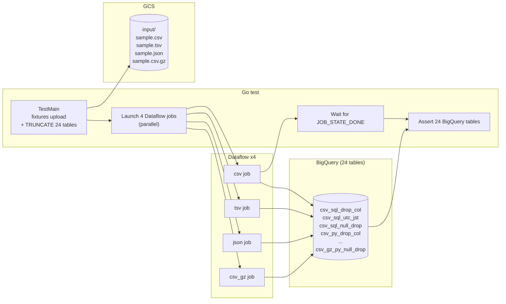
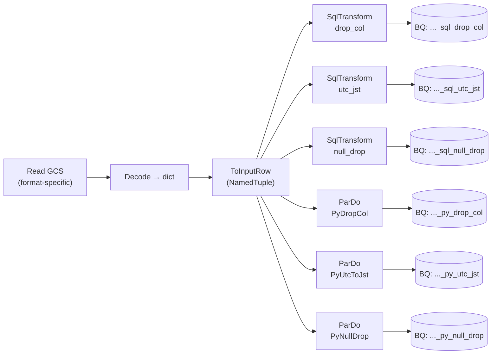

## はじめに

「Dataflow で GCS のファイルを読み込み、ちょっとクレンジングして BigQuery に投入する」というユースケースは多い。しかし、いざやろうとすると意外と論点が多い。

- ファイル形式は CSV / TSV / JSON / 圧縮 CSV あたりまで透過的に扱えるのか？
- 変換ロジックは SQL でも書けるらしいが、Python とどう使い分ければいいのか？同じパイプラインで両方使えるのか？
- カラム削除 / タイムゾーン変換 / NULL 行除去のような典型的なクレンジングを SQL と Python で書くと、結果は本当に一致するのか？

この記事では、**4 ファイル形式 × 2 変換言語 × 3 変換ロジック = 24 ケース**を Terraform で環境構築して Go テストで検証する、という宣言的な仕様検証ワークスペースを作った。

ソースコードは [`samplecodes/dataflow-gcs-to-bq/`](https://github.com/katonium/articles/tree/main/samplecodes/dataflow-gcs-to-bq) に置いてある。

## 結論

先に検証結果のサマリーを書く。

| 軸 | 値 | 結果 |
|---|---|---|
| ファイル形式 | CSV / TSV / JSON (NDJSON) / gzip 圧縮 CSV | すべて 1 つの Beam パイプラインで透過的に読める |
| 変換言語 | SQL (Beam SQL = Calcite) / Python (DoFn) | **同じパイプラインの中で両方を混在させて、結果を別々の BigQuery テーブルに書ける** |
| 変換ロジック | カラム削除 / UTC→JST / NULL 行除去 | SQL でも Python でも同じ結果になる |

「Beam Python から SqlTransform を呼ぶ」というのは cross-language transform で実現されていて、裏では Java の Calcite SQL が動いている。そのため Flex Template の Docker イメージに JRE を仕込まないと動かない、という小さなハマりどころがある。

## なぜ Terraform + Go テストにするのか

検証ワークスペースを作るときの責務分離をはっきりさせたかった。

| レイヤー | 責務 |
|---|---|
| **Terraform** | GCS バケット、Artifact Registry、Flex Template (Docker イメージ + spec)、BigQuery dataset と 24 個の宛先テーブル、Dataflow ワーカー SA、IAM。tfstate はローカル |
| **Go テスト** | フィクスチャの GCS アップロード、テーブル truncate、Dataflow ジョブ起動、ジョブ完了待機、BigQuery アサーション、後片付け |
| **Dataflow パイプライン** | 純粋な ETL のみ。テスト用 cleanup / アサーション / 条件分岐は一切持たない |

ポイントは「**検証対象 (Dataflow パイプライン) にテスト用ロジックを 1 行も入れない**」こと。検証対象とテストハーネスが混ざると、検証対象の挙動がテスト用ロジックに歪まされる。Terraform = インフラ、Go = 検証ロジック、Dataflow = ピュアな ETL、と完全に分けることで「Go の test が通る = Dataflow が期待通りに動いている」という保証になる。

## 検証環境

### 全体像



### 1 本の Dataflow ジョブの中身

各 Dataflow ジョブは下記の DAG を実行する。**1 つの Beam パイプラインの中に SQL ブランチと Python ブランチを並べて、それぞれが別の BigQuery テーブルに書き込む**。



## テストケース

入力データは全フォーマット共通で 5 行。

| id | name | secret | event_at_utc |
|---|---|---|---|
| 1 | Alice | foo | 2026-04-10 01:00:00 |
| 2 | Bob | bar | 2026-04-10 15:30:00 |
| 3 | _NULL_ | baz | 2026-04-10 10:00:00 |
| 4 | Dave | qux | 2026-04-10 23:00:00 |
| 5 | _NULL_ | quux | 2026-04-10 05:00:00 |

これに対して 3 つの変換ロジックを適用する。

| 変換 | 仕様 | 期待結果 |
|---|---|---|
| `drop_col` | `secret` 列を削除する | 5 行、secret 列なし |
| `utc_jst` | `event_at_utc` を UTC+9 して `event_at_jst` として出力 | 5 行、id=2 は翌日 00:30、id=4 は翌日 08:00 |
| `null_drop` | `name` が NULL の行を除去 | 3 行 (id ∈ {1, 2, 4}) |

24 ケースは下記の通り。

| # | format | lang | pattern | 宛先テーブル |
|---|---|---|---|---|
| 1 | csv | sql | drop_col | `csv_sql_drop_col` |
| 2 | csv | sql | utc_jst | `csv_sql_utc_jst` |
| 3 | csv | sql | null_drop | `csv_sql_null_drop` |
| 4 | csv | py | drop_col | `csv_py_drop_col` |
| 5 | csv | py | utc_jst | `csv_py_utc_jst` |
| 6 | csv | py | null_drop | `csv_py_null_drop` |
| 7-12 | tsv | sql/py × 3 | 同上 | `tsv_*` |
| 13-18 | json | sql/py × 3 | 同上 | `json_*` |
| 19-24 | csv_gz | sql/py × 3 | 同上 | `csv_gz_*` |

## 実装

### Beam パイプライン (Python)

ポイントは 3 つ。

#### 1. `SqlTransform` の入力スキーマは NamedTuple で宣言する

`SqlTransform` は Python から呼ぶと cross-language で Java の Calcite SQL に展開される。入力 PCollection には Beam スキーマが必要なので、`typing.NamedTuple` で宣言して `RowCoder` を登録する。

```python
import typing
from apache_beam.coders import RowCoder
import apache_beam as beam

class InputRow(typing.NamedTuple):
    id: int
    name: typing.Optional[str]
    secret: str
    event_at_utc: str  # "YYYY-MM-DD HH:MM:SS"

beam.coders.registry.register_coder(InputRow, RowCoder)
```

`event_at_utc` を `datetime` で持たせると cross-language の Row 変換でハマったため、文字列で運んで SQL 側で `CAST AS TIMESTAMP` する素直な実装にしている。

#### 2. 1 つのパイプラインで SQL ブランチと Python ブランチを並列実行する

Beam のパイプラインは PCollection から複数のブランチに枝分かれできる。同じ `typed_rows` を SQL にも Python にも流して、それぞれが別の BigQuery テーブルに書き込む。

```python
typed_rows = parsed | "ToInputRow" >> beam.Map(to_input_row).with_output_types(InputRow)

# SQL ブランチ
_ = (
    typed_rows
    | "SQL_UtcJst" >> SqlTransform("""
        SELECT id, name, secret,
               TIMESTAMPADD(HOUR, 9, CAST(event_at_utc AS TIMESTAMP)) AS event_at_jst
        FROM PCOLLECTION
    """)
    | "SQL_UtcJst_ToDict" >> beam.Map(_sql_utc_jst_to_dict)
    | "SQL_UtcJst_Write" >> beam.io.WriteToBigQuery(...)
)

# Python ブランチ (同じ typed_rows から)
_ = (
    typed_rows
    | "PY_UtcJst" >> beam.ParDo(PyUtcToJst())
    | "PY_UtcJst_Write" >> beam.io.WriteToBigQuery(...)
)
```

実行すると Dataflow の DAG ビューで枝分かれが確認できる。SQL と Python の結果が別テーブルに書かれるので、同じ入力に対して両者の挙動を直接比較できる。

#### 3. JST 変換は `TIMESTAMPADD(HOUR, 9, ...)` で素直に書く

Calcite SQL には `CONVERT_TIMEZONE` のような関数もあるが、Beam SQL ではランナー依存があり動作が不安定だった。「JST = UTC + 9 時間の常時オフセット」と割り切って `TIMESTAMPADD` で実装する。

```sql
TIMESTAMPADD(HOUR, 9, CAST(event_at_utc AS TIMESTAMP)) AS event_at_jst
```

Python 側は標準の `zoneinfo` を使う。

```python
from zoneinfo import ZoneInfo
utc = datetime.datetime.strptime(row.event_at_utc, "%Y-%m-%d %H:%M:%S").replace(
    tzinfo=ZoneInfo("UTC")
)
jst = utc.astimezone(ZoneInfo("Asia/Tokyo"))
```

両者とも BigQuery には「絶対時刻として UTC+9 された TIMESTAMP」が書き込まれる。BQ の TIMESTAMP は UTC で保持されるので、最終的にはどちらも同じ値になる。

### Flex Template の Dockerfile に JRE を入れる

ここが一番のハマりどころだった。

`apache_beam.transforms.sql.SqlTransform` は cross-language transform で、バックエンドは **Java で書かれた Calcite SQL の expansion service**。Python SDK が Java プロセスを起動して、そこに SQL の解析と PTransform 展開を依頼する。

Flex Template の Python ベースイメージ (`gcr.io/dataflow-templates-base/python311-template-launcher-base`) には JRE が入っていないので、そのまま `SqlTransform` を呼ぶと expansion service の起動に失敗する。

```dockerfile
FROM gcr.io/dataflow-templates-base/python311-template-launcher-base

RUN apt-get update \
    && apt-get install -y --no-install-recommends openjdk-17-jre-headless \
    && rm -rf /var/lib/apt/lists/*

ENV JAVA_HOME=/usr/lib/jvm/java-17-openjdk-amd64

# ...
```

JRE を入れるとイメージサイズは増えるが、`SqlTransform` を使うなら避けて通れない。

### Terraform で Flex Template ビルドまで自動化する

Terraform の責務に「Dataflow パイプライン (= Flex Template) の作成」を入れたかったので、`null_resource` で `gcloud` を local-exec する。

```hcl
locals {
  pipeline_source_hash = sha256(join("", [
    filesha256("${local.pipeline_dir}/Dockerfile"),
    filesha256("${local.pipeline_dir}/pipeline.py"),
    filesha256("${local.pipeline_dir}/transforms.py"),
    filesha256("${local.pipeline_dir}/requirements.txt"),
    filesha256("${local.pipeline_dir}/metadata.json"),
  ]))
}

resource "null_resource" "flex_template_build" {
  triggers = {
    source_hash = local.pipeline_source_hash
    image_uri   = local.image_uri
    spec_path   = local.template_spec_gcs_path
  }

  provisioner "local-exec" {
    working_dir = local.pipeline_dir
    command     = <<-EOT
      set -euo pipefail
      gcloud builds submit --project=${var.project_id} --tag=${local.image_uri} .
      gcloud dataflow flex-template build ${local.template_spec_gcs_path} \
        --project=${var.project_id} \
        --image=${local.image_uri} \
        --sdk-language=PYTHON \
        --metadata-file=metadata.json
    EOT
  }
}
```

`pipeline/` 配下のソースに変化があったら trigger が変わって自動で再ビルドされる。Terraform 完結で「コード変更 → イメージ再ビルド → spec 更新」が回せる。

### 24 個の BigQuery テーブルは locals で直積展開する

3 種類のスキーマ × 4 ファイル形式 × 2 変換言語 = 24 テーブルを `for_each` 一発で生成する。

```hcl
locals {
  formats  = ["csv", "tsv", "json", "csv_gz"]
  langs    = ["sql", "py"]
  patterns = {
    drop_col  = local.schema_drop_col
    utc_jst   = local.schema_utc_jst
    null_drop = local.schema_null_drop
  }

  table_specs = merge([
    for fmt in local.formats : merge([
      for lang in local.langs : {
        for pat, schema in local.patterns :
        "${fmt}_${lang}_${pat}" => { schema = schema }
      }
    ]...)
  ]...)
}

resource "google_bigquery_table" "destinations" {
  for_each = local.table_specs

  project             = var.project_id
  dataset_id          = google_bigquery_dataset.verification.dataset_id
  table_id            = each.key
  deletion_protection = false
  schema              = each.value.schema
}
```

Terraform 上で `csv_sql_drop_col` から `csv_gz_py_null_drop` まで 24 テーブルが宣言的に作られる。

### Go テストで Dataflow ジョブを 4 並列起動する

Dataflow REST API クライアント (`google.golang.org/api/dataflow/v1b3`) で Flex Template を起動する。

```go
func launchFlexTemplate(ctx context.Context, tf *tfOutput, format string) (string, error) {
    svc, err := dataflow.NewService(ctx)
    if err != nil { return "", err }

    req := &dataflow.LaunchFlexTemplateRequest{
        LaunchParameter: &dataflow.LaunchFlexTemplateParameter{
            JobName:              fmt.Sprintf("df-gcs-to-bq-%s-%d", format, time.Now().Unix()),
            ContainerSpecGcsPath: tf.TemplateSpecGCSPath,
            Parameters: map[string]string{
                "format":              format,
                "input_path":          fmt.Sprintf("gs://%s/%s", tf.BucketName, formatToInputObject[format]),
                "output_table_prefix": format,
                "bq_project":          tf.ProjectID,
                "bq_dataset":          tf.DatasetID,
            },
            Environment: &dataflow.FlexTemplateRuntimeEnvironment{
                ServiceAccountEmail: tf.DataflowWorkerSAEmail,
                TempLocation:        fmt.Sprintf("gs://%s/temp/", tf.BucketName),
                StagingLocation:     fmt.Sprintf("gs://%s/staging/", tf.BucketName),
            },
        },
    }

    resp, err := svc.Projects.Locations.FlexTemplates.Launch(tf.ProjectID, tf.Region, req).Do()
    if err != nil { return "", err }
    return resp.Job.Id, nil
}
```

ジョブの完了待機は `JOB_STATE_DONE` を 15 秒ポーリング。失敗ステート (`JOB_STATE_FAILED` / `JOB_STATE_CANCELLED` 等) を踏んだらすぐエラーを返す。

```go
func waitForJob(ctx context.Context, projectID, region, jobID string) (string, error) {
    // ...
    for time.Now().Before(deadline) {
        job, _ := svc.Projects.Locations.Jobs.Get(projectID, region, jobID).Do()
        switch job.CurrentState {
        case "JOB_STATE_DONE":
            return job.CurrentState, nil
        case "JOB_STATE_FAILED", "JOB_STATE_CANCELLED", "JOB_STATE_DRAINED":
            return job.CurrentState, fmt.Errorf("job %s terminated in state %s", jobID, job.CurrentState)
        }
        time.Sleep(15 * time.Second)
    }
    // ...
}
```

4 ジョブを goroutine で並列起動 → 全完了待ち → 24 テーブルにアサーションをかける、という流れ。

### アサーションは正規化文字列の完全一致

BigQuery から取った行を `[]bigquery.Value` で受けて、`time.Time` は UTC 文字列、`nil` は `<nil>` という形式に正規化してから期待値と比較する。

```go
func normalize(row []bigquery.Value) []string {
    out := make([]string, len(row))
    for i, v := range row {
        switch x := v.(type) {
        case nil:
            out[i] = "<nil>"
        case time.Time:
            out[i] = x.UTC().Format("2006-01-02 15:04:05")
        case int64:
            out[i] = fmt.Sprintf("%d", x)
        case string:
            out[i] = x
        }
    }
    return out
}
```

期待値はテストコードのリテラルで持つ。

```go
want := [][]string{
    {"1", "Alice", "foo", tsStr(plus9h(inputUTC[1]))}, // 2026-04-10 10:00:00
    {"2", "Bob", "bar", tsStr(plus9h(inputUTC[2]))},   // 2026-04-11 00:30:00
    {"3", "<nil>", "baz", tsStr(plus9h(inputUTC[3]))}, // 2026-04-10 19:00:00
    {"4", "Dave", "qux", tsStr(plus9h(inputUTC[4]))},  // 2026-04-11 08:00:00
    {"5", "<nil>", "quux", tsStr(plus9h(inputUTC[5]))}, // 2026-04-10 14:00:00
}
```

`go test -v ./...` を回すと 24 個の subtest がそれぞれ `format=csv/lang=sql/pattern=drop_col` のような名前で並ぶ。

## 実行

```bash
export GOOGLE_CLOUD_PROJECT="your-project-id"

make init
make apply    # Terraform で GCS / BQ / SA / Flex Template を作成
make test     # Go テストで Dataflow ジョブ起動 → 24 ケース検証
make destroy  # 後片付け
```

`make all` で apply → test → destroy を一気通貫で実行できる。

## わかったこと

- **Beam Python SDK の `SqlTransform` は実用に耐える**。cross-language の制約 (Java 必須、入力に NamedTuple スキーマが必要) を踏まえれば、SQL ブランチと Python ブランチを同じパイプラインに並べて結果を比較する、という使い方が綺麗にハマる。
- **CSV / TSV / JSON / gzip CSV は `ReadFromText` だけで透過的に扱える**。`compression_type=AUTO` がデフォルトで、`.gz` 拡張子から自動判別される。JSON は NDJSON にして `json.loads` で素直に dict 化するのが一番扱いやすい。
- **JST 変換はランナー依存しない `TIMESTAMPADD(HOUR, 9, ...)` が確実**。`CONVERT_TIMEZONE` のようなタイムゾーン関数は Beam SQL では避けたほうがいい。
- **検証ワークスペースは責務を完全に切ると読みやすくなる**。Terraform = インフラ、Go = 検証、Dataflow = ピュアな ETL。Dataflow 側にテスト用ロジックを 1 行も入れないことで、検証対象の挙動がテストハーネスに歪まされない。

## おわりに

Dataflow はジョブ起動から完了まで時間がかかるので、検証コードはどうしても「キックして待つ」が中心になる。それでも宣言的に書ければ、24 ケース全部 1 コマンドで回せて、結果が緑か赤かで判断できる。

ソースは [`samplecodes/dataflow-gcs-to-bq/`](https://github.com/katonium/articles/tree/main/samplecodes/dataflow-gcs-to-bq)。
