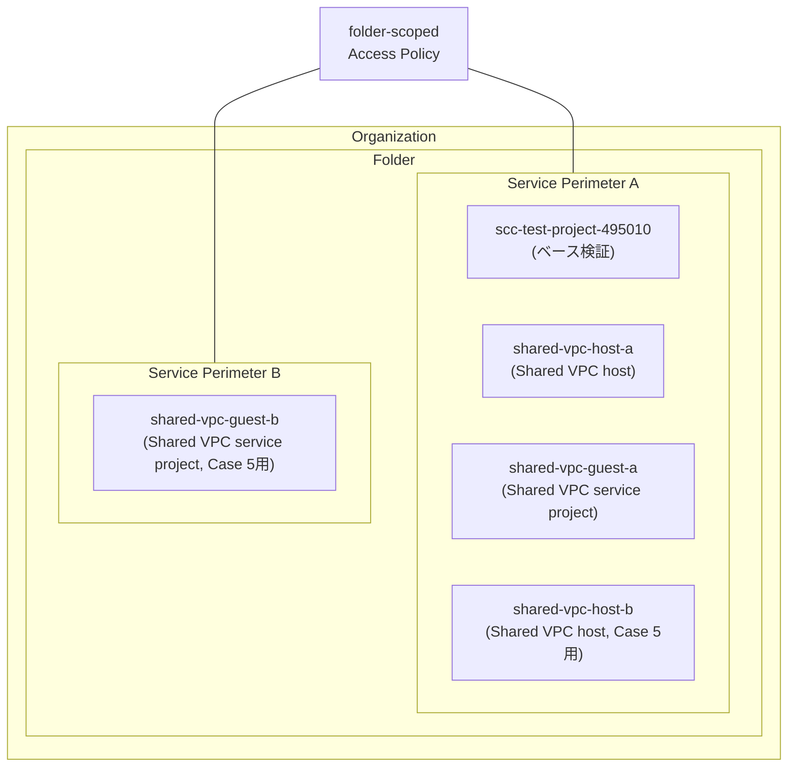
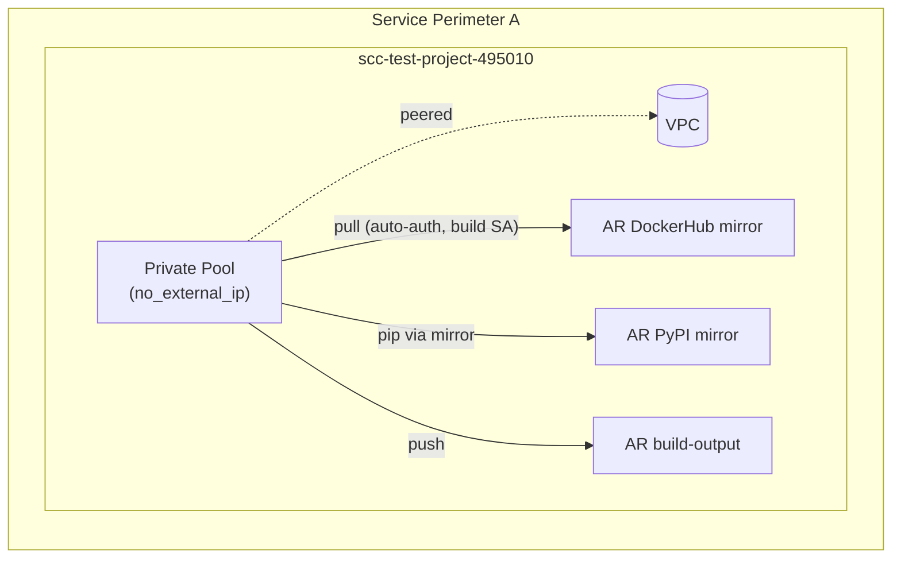
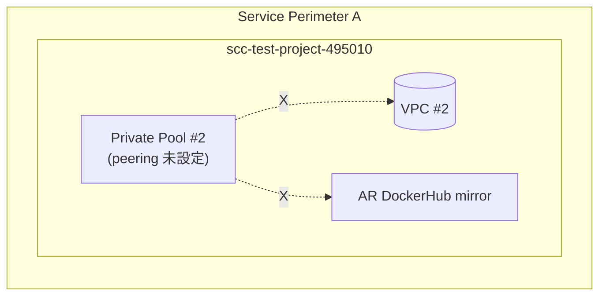
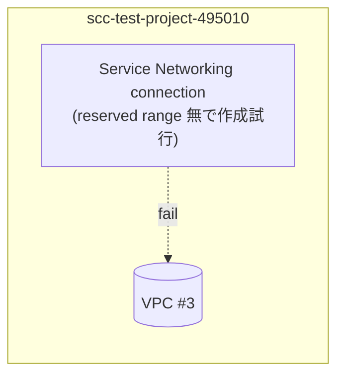
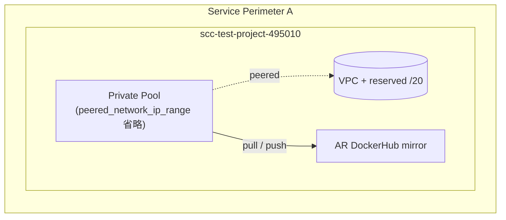
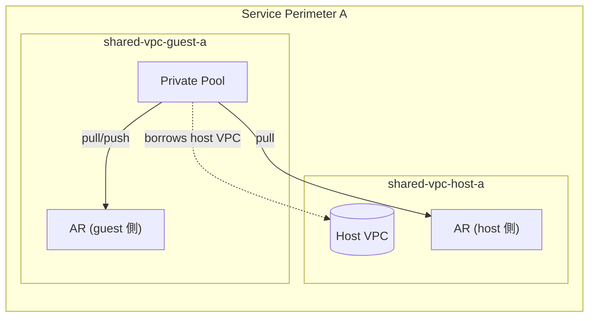
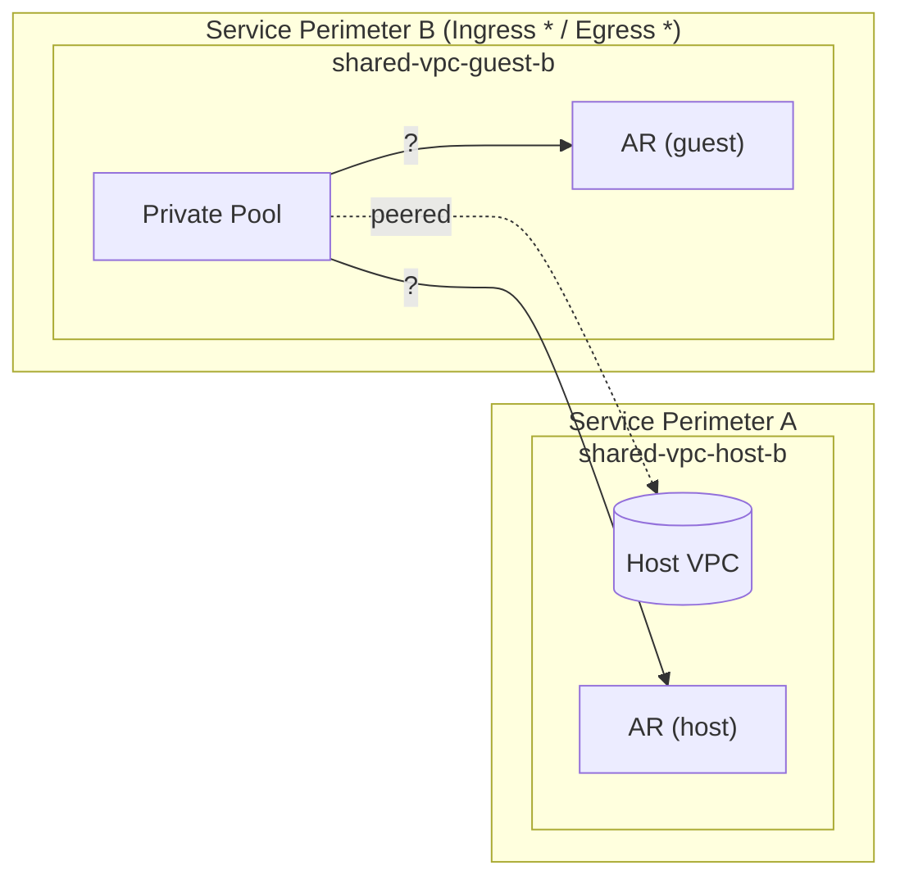
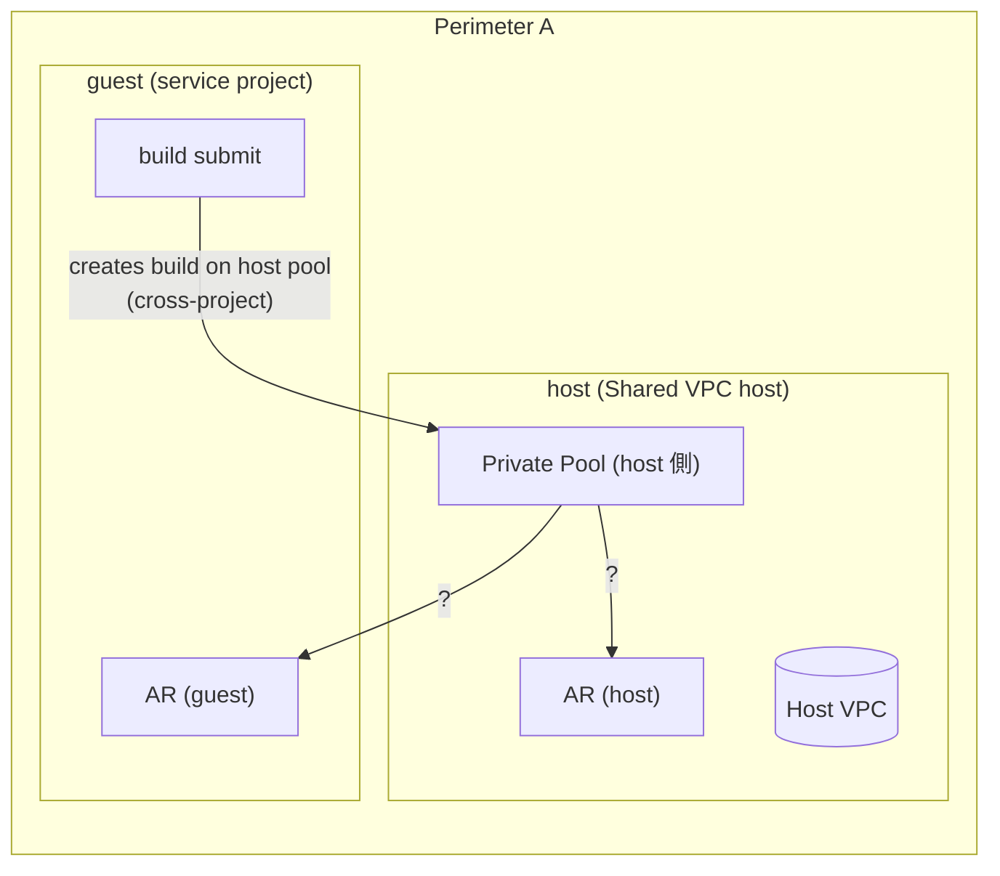
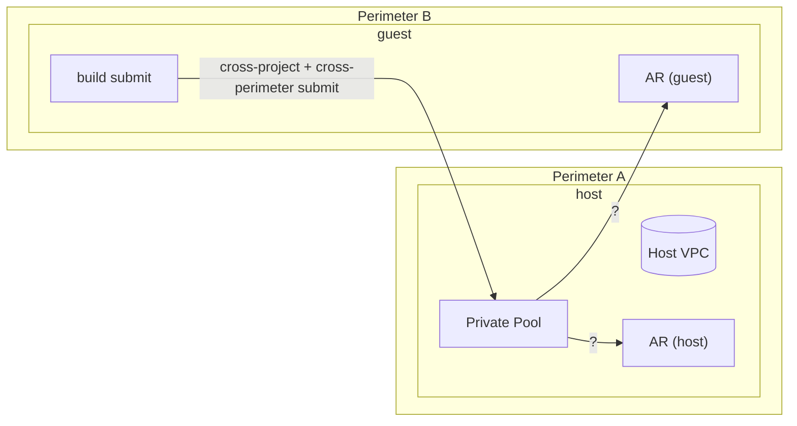
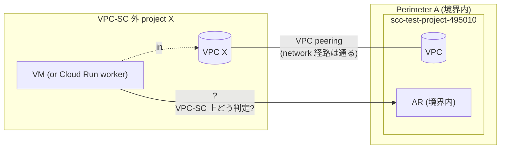

# VPC-SC 越し Cloud Build Private Pool 検証

## 検証の意図

VPC Service Controls 配下に Cloud Build Private Pool を置くと、ある条件下では
追加の Ingress / Egress ポリシーなしで境界内のリソース（Artifact Registry 等）へ
アクセスできる。これは「Private Pool が **暗黙に** VPC-SC 境界の内側として扱われる」
という挙動による。

ただし、どのリソース構成のときに「境界内」と判定され、どの構成だと「境界外」と
扱われるのかが、Cloud Build / VPC-SC / Shared VPC の組み合わせによって変わる。

本検証では以下の問いに、Terraform で構成を作り Go テストで build job を回して
答えることを目的とする:

- どの条件で Private Pool は VPC-SC 境界内として振る舞うのか
- どの条件だと境界外扱いになり拒否されるのか
- Shared VPC（ホスト / ゲスト分離）の場合に挙動はどう変わるか
- 境界が host / guest で分かれているとき、どちらの project にだけ通るのか

## 検証の構成

### インフラ全体図



### Access Policy / Perimeter

- **folder-scoped Access Policy**: `parent = organizations/<ORG_ID>`,
  `scopes = ["folders/<FOLDER_ID>"]`。組織全体ではなくフォルダ単位に閉じる。
  実値は `terraform.tfvars` で渡し、コードや README には記載しない。
- **Perimeter A**: ベース project + Shared VPC host-a/guest-a + host-b の 4 projects。
  メインの検証パスはここに集約。
- **Perimeter B**: guest-b のみ。Case 5 の境界分離検証専用。
- **Ingress policy**: 両 perimeter とも `user:<管理者メアド>` を identity として
  許可 (Terraform apply / 開発者操作のため)。
  `source.access_level = "*"` / `service_name = "*"` で any。

### プロジェクト一覧

| project | 役割 | 所属 perimeter | VPC | Private Pool | 主に使う Case |
|---|---|---|---|---|---|
| `scc-test-project-495010` (既存) | ベース検証 | A | 自プロジェクト VPC | `pool-base` (peering 有), `pool-noPeering` (peering 無, Case 1), `pool-defaultRange` (peered_network_ip_range 省略, Case 2b) | 0, 1, 2a, 2b |
| `shared-vpc-host-a` | Shared VPC host | A | `host-vpc-a` (Shared 公開) | なし (host には pool を置かない、 Case 4 用に追加で置く) | 3, 4 |
| `shared-vpc-guest-a` | Shared VPC service project (host-a の VPC を借用) | A | host-a の VPC を借用 | `pool-guest-a` (Case 3用) / `pool-host-a` (host-a 上、Case 4用) | 3, 4 |
| `shared-vpc-host-b` | Shared VPC host | A | `host-vpc-b` | なし | 5 |
| `shared-vpc-guest-b` | Shared VPC service project (host-b の VPC を借用) | **B** | host-b の VPC を借用 | `pool-guest-b` | 5 |

### Artifact Registry

- 各 project に **DockerHub mirror (REMOTE)** + **PyPI mirror (REMOTE)** + **build-output (STANDARD)** の 3 repo を配置。
- 各 region で `google_artifact_registry_vpcsc_config.vpcsc_policy = "ALLOW"` を 1 つ設定し、AR の REMOTE 上流 fetch だけは VPC-SC を素通りさせる
  (perimeter の egressPolicies を直接いじらない王道)。

---

## テストケース

### Case 0: ベース (Private Pool が境界内として動く)

**構成**



**観点**: Private Pool worker → 同 project の AR は **Ingress policy 不要** で通るか

**期待**:
- Build job が DockerHub mirror から `python:3.12-slim` を pull、PyPI mirror から
  `requests` を install、build-output に push まで成功 (`SUCCESS`)
- Build SA は Ingress identities に含まれていない。それでも通る = pool が境界内扱い

### Case 1: VPC peering 不在 → AR 不通

**構成**



**観点**: Service Networking connection が無いと、worker が consumer VPC と繋がらず、私設 DNS ゾーン経由で `pkg.dev` を restricted VIP に解決する経路も成立しない → AR 到達不可

**期待**:
- pool そのものは作れるが、build job 内 `docker pull <AR_image>` が timeout / DNS 解決失敗で **FAILURE**

### Case 2a: VPC 側の reserved IP range が無い → peering 確立不可

**構成**



**観点**: `google_compute_global_address (purpose=VPC_PEERING)` で /N の reserved CIDR を確保していないと、`google_service_networking_connection` が引数不足で確立できない → 結果として private pool も `peered_network` を指定して作れない

**期待**:
- **Terraform apply 段階で失敗する**ことを記述する static な検証 (Go テストで Build を投入する手前の話)。本ケースは README で原理を示し、リソースは Terraform 側で `count = 0` のコメントアウト形にして「やってみたければ enable」 という形にする

### Case 2b: `peered_network_ip_range` を省略 → default で動く

**構成**



**観点**: pool の `peered_network_ip_range` を指定しない場合、Cloud Build は default のサブレンジ幅で peering を確立する。指定が必須ではないことを正の挙動として確認

**期待**:
- Build job が SUCCESS。`peered_network_ip_range` 省略でも特別な対応不要

### Case 3: Shared VPC のゲスト側に pool、 同一 perimeter

**構成**



**観点**: Shared VPC で pool が **service project (guest)** 側にあるとき、host project の AR にも guest project の AR にもアクセスできるか

**期待**:
- guest pool → guest AR 成功 (同 project)
- guest pool → host AR 成功 (同 perimeter なので境界内扱い、Shared VPC で network経路もOK)
- 両方とも SUCCESS

### Case 4: 境界が host / guest で分割（poolはguest, VPCはhost）

**構成**



**観点**: pool は guest 側 (perimeter B)、利用する VPC は host 側 (perimeter A)。Ingress / Egress を `*` で全許可しても、 VPC-SC の保護対象は project resource なので、 **pool が居る perimeter B に protected な resource (= guest AR)** 側にしか到達できない、という仮説の検証

**期待 (仮説)**:
- guest pool → guest AR (同 perimeter B): 成功
- guest pool → host AR (perimeter A): VPC-SC violation で失敗
- 「pool が居る側」 が「境界内」 として優先される

注: この期待が逆 (「VPC が居る側に通る」) の場合は新たな知見なので、結果に応じてREADMEを更新する。

---

## ディレクトリ構成 (実装後)

```
samplecodes/cloudbuild-private-pool/
├── README.md                      # 本ファイル
├── 00_providers.tf                # google + google-beta provider
├── 01_variables.tf
├── 02_apis.tf
├── 03_vpc-sc.tf                   # Access Policy + Perimeter A + Perimeter B
├── 04_projects.tf                 # 新規 project (host-a/guest-a/host-b/guest-b)
├── 05_vpc-base.tf                 # Case 0/1/2a/2b 用 (scc-test-project-495010)
├── 06_vpc-shared-a.tf             # Case 3/4 用 Shared VPC (host-a + guest-a)
├── 07_vpc-shared-b.tf             # Case 5 用 Shared VPC (host-b + guest-b)
├── 08_artifact_registry.tf        # 各 project の AR repo + vpcsc_config
├── 09_cloudbuild.tf               # 各 pool (base / noPeering / defaultRange / shared-a / shared-b)
├── 10_iam.tf
├── 11_outputs.tf
├── private_pool_test.go           # Case 0..5 を Go test で
├── Makefile
├── terraform.tfvars.example
└── .gitignore
```

## Test Plan

| Case | テスト関数 | 期待 status |
|---|---|---|
| 0 | `TestCase0_BaseInPerimeter_DockerBuildSucceeds` | SUCCESS |
| 0 (negative) | `TestCase0_BaseInPerimeter_ExternalAccessDenied` | FAILURE |
| 1 | `TestCase1_NoPeering_DockerBuildFails` | FAILURE |
| 2a | (Terraform apply で失敗する旨を README に記述、 Go テスト無し) | — |
| 2b | `TestCase2b_DefaultPeeredRange_DockerBuildSucceeds` | SUCCESS |
| 3 | `TestCase3_SharedVPC_GuestPool_PullHostAR` | SUCCESS |
| 3 | `TestCase3_SharedVPC_GuestPool_PullGuestAR` | SUCCESS |
| 4 | `TestCase4_SplitPerimeter_GuestPool_PullGuestAR` | SUCCESS |
| 4 | `TestCase4_SplitPerimeter_GuestPool_PullHostAR_Denied` | FAILURE |

## 機密情報の取り扱い

- folder ID / project ID / org ID / 管理者メアド / billing account ID はすべて
  `terraform.tfvars` (gitignored) のみに保持
- `terraform.tfvars.example` には placeholder のみ
- README / コード上のサンプルはすべて変数経由で参照する形にとどめ、 git 履歴に
  実値が残らないようにする

---

## 追加検証候補 (本 PR スコープ外)

時間 / コスト / 実用性の理由で本 PR では実装しないが、検証として価値があり
今後追加する候補。気が向いたら別 PR で。

### 候補 A: Shared VPC のホスト側に pool、 ゲストから build を submit (同 perimeter)



**観点**: pool を host project に置き、 build 投入は guest project 側から行う
構成 (cross-project build)。実運用では稀だが、 host project が共有インフラ用、
guest project が業務用、 という組織分割があり得る

**期待**: 両 project の AR にアクセス可 (両方 SUCCESS)

### 候補 B: 候補 A と同パターンで host / guest が境界分離



**観点**: 候補 A の境界分離版。pool が host (Perimeter A)、 build 投入が
guest (Perimeter B)。 cross-project と cross-perimeter が重なる
シナリオで、 どちら側の AR に通るか / 両方 deny になるか

**期待 (仮説)**: 候補 A の host 側 (= pool 配置側) の AR に通る、guest側はdeny

### 候補 C: 境界外 project と境界内 VPC を peering したときの境界判定



**観点**: 「Cloud Build private pool は producer VPC と consumer VPC の
**Service Networking peering** で境界内扱いになる」 という挙動と、
**通常の VPC peering** とは区別される。境界外 project X の VPC を
境界内 VPC と通常 VPC peering したとき、 caller (X の VM) は境界内
resource (AR) にアクセスできるか

**仮説**:
- 通常の VPC peering は network 経路を繋ぐだけで、 VPC-SC は **caller の
  project が perimeter resources に含まれているか** で判定する
- caller (X の VM) は境界外 project に属するため、 VPC-SC violation で deny
- つまり「peering したから境界内」 ではなく、 Cloud Build private pool の
  Service Networking 経由は **特別扱い** (consumer project の perimeter内と
  みなされる) という結論になる想定

**ドキュメント**:
- 公式 doc が言及している可能性が高い領域。 実装前に
  `cloud.google.com/vpc-service-controls/docs/share-across-perimeters`
  や private pool VPC-SC ガイドを再確認すると、 仮説が補強できるはず
